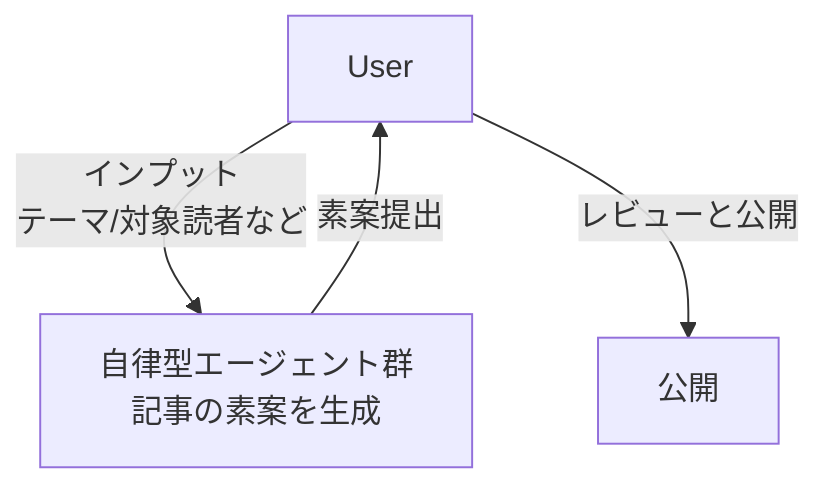
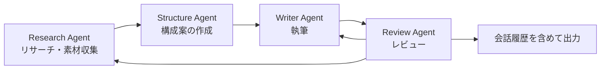

## はじめに

最近、自律型AIエージェントが大きな注目を集めています。
本記事では自律型AIエージェントを構築する方法としてマルチエージェント方式を紹介します。
マルチエージェント方式は、人間の力だけでは時間や手間がかかるタスクを複数のAIエージェントを連携させることで自律的に解決します。

本記事は、AutoGenというマルチエージェントフレームワークを用いて、AIエージェント同士が分担・協調しながら記事を生成するプロセスを、実装例を交えて解説します。

**対象読者**: LLMやエージェントの基礎知識を持ち、AutoGenやCrewAI等の導入・実践を検討している中級以上のエンジニアを想定しており、以下の内容を丁寧に解説していきます。

- AIエージェントと自律型AIエージェントの違い
- AutoGenとは？
- AutoGenを使った記事作成の全体像
    - 具体的な記事作成ワークフロー
- 実践ステップ
    - コード例・実装Tips
- ハマりやすいポイント

### AIエージェントと自律型AIエージェントの違い

現在の多くのAIエージェントはある程度の判断力でシンプルなタスクを自動化できます。
自律型AIエージェントはさらに発展形としてエージェント自身が目標を解釈し、試行錯誤しながら複雑なタスクをこなす点が特徴です。
両者を平易に言えば以下の違いがあります。

- AIエージェント
    - 「人間が決めた目的・ルールに従って動くAI」
- 自律型AIエージェント
    - 「大まかな目標だけ与えれば自分で考えて動くAI」

今回紹介するマルチエージェント方式の自律型AIエージェントは大きな課題を役割分担して解決する仕組です。

人間の組織やチームも人同士が協力してタスクを役割分担して一人ではできない目標を達成させますが、マルチエージェント方式はそれを人の代わりにAI同士が協力して目標を達成します。

## AutoGenとは？

AutoGenはMicrosoft製のフレームワークで、PythonとLLM（大規模言語モデル）を土台に、多様なエージェントを簡単に組み合わせられるのが特徴です。
競合にはCrewAIやMetaGPTなどもありますが、AutoGenは柔軟な会話設計やツール連携性に優れています。

https://github.com/microsoft/autogen

## AutoGenを使った記事作成の全体像

1. AI同士が集まって記事を作成
2. AIの出力結果を人間によってチェック
3. 公開



### AIが協力して記事を作成


「調査→設計→執筆→レビュー」といった工程を複数エージェントが役割分担します。
それぞれのエージェントは独立して動きますが、チャット形式で情報を受け渡し、意見がまとまれば記事案が完成します。

今回は以下のように分担をしています。

- ResearchAgent:
  - 技術トピックに基づき、Qiita/Zennなどを検索して技術テーマに対する情報を整理する
- StructureAgent:
  - 読者タイプから文書の構成パターンを検討する
- WriterAgent:
  - 本文作成
- ReviewAgent:
  - 記事をレビューする（曖昧な表現がないかなど）

これらのやり取りは「対話ループ」として設計するのがポイントです。
単なる一問一答でなく、何度か会話を繰り返しながらアウトプットを調整します。
また、無限ループを避けるため終了条件（規定回数、特定キーワードなど）も必須です。



### 記事の素案を人間が修正して承認


## 実践ステップ

### Step 1: 環境準備

まずはPython実行環境（**Python 3.11 以上を推奨**）を用意し、AutoGenと必要なライブラリをインストールします。  
LLMを利用するためには、OpenAIのAPIキーを取得しておきましょう。

```bash
# AutoGenStudioは autogen-agentchat などを内包した統合パッケージです
poetry add autogenstudio

# APIキーは.envに定義し、環境変数に読み込みます（dotenvなど利用）
export OPENAI_API_KEY="sk-xxxx..."
export GOOGLE_API_KEY="xxxxxxxxxxx"
export GOOGLE_CSE_ID="xxxxxxxxxxx"
```

#### 💡 **Google検索用のAPIキーとCSE IDの取得について**

Googleのプログラム可能な検索エンジンを利用するためには、2つの情報が必要です。
⚠️ 注意：無料枠には1日の検索回数制限（100クエリ/日）があります。

- `GOOGLE_API_KEY`：Google Cloud Consoleで取得（API有効化が必要）
- `GOOGLE_CSE_ID`：カスタム検索エンジン作成時に発行されるID  

初めて設定する方は、以下の動画チュートリアルが参考になります。

:::details `参考`

https://zenn.dev/umi_mori/books/prompt-engineer/viewer/web_google_api_langchain_chatgpt

https://youtu.be/Py0X-uscoRQ?t=132

:::

### Step 2: ディレクトリ構成の準備

```txt
.
├── .devcontainer/              # VSCode Dev Container 設定（任意）
├── app/
│   ├── agents/                 # 各エージェントの定義（プロンプト・振る舞い）
│   │   └── xxxxxxxAgent/
│   ├── base.py                 # エージェント共通ベース
│   ├── models/                 # LLMとの接続層（例：OpenAI APIのラッパ）
│   │   └── models.py
│   ├── teams/                  # エージェントの協働チームロジック
│   │   └── generater.py
│   └── tools/                  # 情報取得・外部ツール
│       ├── fetch_webpage.py
│       ├── fetch_webpdf.py
│       └── google_search.py
├── .env
├── .env.example
├── .gitignore
├── docker-compose.yml          # コンテナ構成（任意）
├── Dockerfile                  # コンテナ（任意）
├── generate.py                 # 実行エントリーポイント
├── poetry.lock
└── pyproject.toml              # Poetry管理ファイル
```

:::details `app/base.py`

```python
from autogen_agentchat.agents import AssistantAgent

from app.models.openai import model_leader, model_manager, model_worker

# 企業理念などの全エージェントに共通して設定したい内容
common_suffix = """"""


class CustomAssistantAgent(AssistantAgent):
    """全エージェントに共通して末尾にセットするアシスタントエージェント"""

    def __init__(self, name, system_message=None, **kwargs):
        # system_message があれば末尾に追加、なければ共通メッセージのみ
        if system_message:
            system_message += common_suffix
        else:
            system_message = common_suffix

        # 親クラスの初期化に渡す
        super().__init__(name=name, system_message=system_message, **kwargs)


class WorkerAssistantAgent(CustomAssistantAgent):
    """データ収集などの比較的雑務に近い作業を実施するアシスタントエージェント
    モデルは「コスト重視・雑務自動化に最適」なモデルを使う
    """

    def __init__(self, name, system_message=None, **kwargs):
        model_client = model_worker()

        # 親クラスの初期化に渡す
        super().__init__(
            name=name,
            system_message=system_message,
            model_client=model_client,
            **kwargs,
        )


class LeaderAssistantAgent(CustomAssistantAgent):
    """推論寄りの作業を実施するアシスタントエージェント
    モデルは「ブレスト・方向性整理」等を得意にするモデルを使う
    """

    def __init__(self, name, system_message=None, **kwargs):
        model_client = model_leader()

        # 親クラスの初期化に渡す
        super().__init__(
            name=name,
            system_message=system_message,
            model_client=model_client,
            **kwargs,
        )


class ManagerAssistantAgent(CustomAssistantAgent):
    """高度な推論作業を実施するアシスタントエージェント
    モデルは「ブレスト・方向性整理」等を得意にするモデルを使う
    """

    def __init__(self, name, system_message=None, **kwargs):
        model_client = model_manager()

        # 親クラスの初期化に渡す
        super().__init__(
            name=name,
            system_message=system_message,
            model_client=model_client,
            **kwargs,
        )
```

:::

:::details `app/models/models.py`

```python
from autogen_core.models import ChatCompletionClient
from autogen_ext.models.openai import OpenAIChatCompletionClient
from autogen_ext.models.openai._openai_client import ModelInfo

MAX_RETRIES = 5
TIMEOUT = 60


def model_manager() -> ChatCompletionClient:
    family = "o3-2025-04-16"  # o3にするべきと思われる
    model_info = ModelInfo(
        structured_output=True,
        vision=False,
        function_calling=True,
        json_output=True,
        family=family,
    )

    return OpenAIChatCompletionClient(
        model=family,
        model_info=model_info,
        max_retries=MAX_RETRIES,
        timeout=TIMEOUT,
    )


def model_leader() -> ChatCompletionClient:
    family = "gpt-4.1-2025-04-14"
    model_info = ModelInfo(
        structured_output=True,
        vision=False,
        function_calling=True,
        json_output=True,
        family=family,
    )

    return OpenAIChatCompletionClient(
        model=family,
        model_info=model_info,
        max_retries=MAX_RETRIES,
        timeout=TIMEOUT,
    )


def model_worker() -> ChatCompletionClient:
    family = "gpt-4.1-mini-2025-04-14"
    model_info = ModelInfo(
        structured_output=True,
        vision=False,
        function_calling=True,
        json_output=True,
        family=family,
    )

    return OpenAIChatCompletionClient(
        model=family,
        model_info=model_info,
        max_retries=MAX_RETRIES,
        timeout=TIMEOUT,
    )
```

:::

:::details `app/tools/xxxx.py`

```python: google_search.py
from datetime import datetime, timedelta

from app.tools.fetch_webpage import fetch_webpage
from app.tools.fetch_webpdf import fetch_webpdf


async def google_search(
    query: str,
    num_results: int = 10,
    go_back_days: int | None = None,
) -> list:  # type: ignore[type-arg]
    import os
    import time

    import requests  # type: ignore
    from dotenv import load_dotenv

    load_dotenv()

    api_key = os.getenv("GOOGLE_API_KEY")
    search_engine_id = os.getenv("GOOGLE_CSE_ID")

    if not api_key or not search_engine_id:
        raise ValueError(
            "API key or Search Engine ID not found in environment variables"
        )

    q = str(query)

    if go_back_days is not None:
        go_back = datetime.today() - timedelta(days=go_back_days)
        q = q + f" after:{go_back.strftime("%Y-%m-%d")}"

    url = "https://customsearch.googleapis.com/customsearch/v1"
    params = {
        "key": str(api_key),
        "cx": str(search_engine_id),
        "q": q,
        "num": str(num_results),
    }

    response = requests.get(url, params=params)

    if response.status_code != 200:
        print(response.json())
        raise Exception(f"Error in API request: {response.status_code}")

    results = response.json().get("items", [])

    enriched_results = []
    for item in results:
        if str(item["link"]).lower().endswith(".pdf"):
            body = await fetch_webpdf(item["link"])
        else:
            body = await fetch_webpage(item["link"])

        enriched_results.append(
            {
                "title": item["title"],
                "link": item["link"],
                "snippet": item["snippet"],
                "body": body,
            }
        )
        time.sleep(1)  # Be respectful to the servers

    return enriched_results
```

```python: fetch_webpage.py
from typing import Dict, Optional


async def fetch_webpage(
    url: str,
    include_images: bool = True,
    max_length: Optional[int] = 10000,
    headers: Optional[Dict[str, str]] = None,
) -> str:
    """
    指定されたURLのWebページを非同期に取得し、Markdown形式でテキストとして返します。

    ページのHTMLを解析し、スクリプトやスタイル要素を除去したうえで、
    相対URLを絶対URLに変換し、Markdown形式に変換します。

    Parameters:
    ----------
    url : str
        取得対象のWebページのURL。

    include_images : bool, optional (default=True)
        画像リンクをMarkdownに含めるかどうか。

    max_length : Optional[int], optional (default=100000)
        返されるMarkdownの最大長。超過する場合は切り詰められます。
        Noneを指定すると切り詰めを行いません。

    headers : Optional[Dict[str, str]], optional
        HTTPリクエストに使用するヘッダー。省略時は標準のUser-Agentを使用。

    Returns:
    -------
    str
        Markdown形式に変換されたWebページの内容。

    Raises:
    ------
    ValueError
        通信エラーやHTML解析エラーが発生した場合に送出されます。
    """

    from urllib.parse import urljoin

    import html2text
    import httpx
    from bs4 import BeautifulSoup, Tag

    # Use default headers if none provided
    if headers is None:
        headers = {
            "User-Agent": "Mozilla/5.0 (Windows NT 10.0; Win64; x64) AppleWebKit/537.36"
        }

    try:
        # Fetch the webpage
        async with httpx.AsyncClient() as client:
            response = await client.get(url, headers=headers, timeout=10)
            response.raise_for_status()

            # Parse HTML
            soup = BeautifulSoup(response.text, "html.parser")

            # Remove script and style elements
            for script in soup(["script", "style"]):
                script.decompose()

            # Convert relative URLs to absolute
            for tag in soup.find_all(["a", "img"]):
                if isinstance(tag, Tag):
                    if tag.get("href"):
                        href = tag.get("href")
                        tag["href"] = urljoin(
                            url,
                            href if isinstance(href, str) else "",
                        )
                    if tag.get("src"):
                        src = tag.get("src")
                        tag["src"] = urljoin(
                            url,
                            src if isinstance(src, str) else "",
                        )

            # Configure HTML to Markdown converter
            h2t = html2text.HTML2Text()
            h2t.body_width = 0  # No line wrapping
            h2t.ignore_images = not include_images
            h2t.ignore_emphasis = False
            h2t.ignore_links = False
            h2t.ignore_tables = False

            # Convert to markdown
            markdown = h2t.handle(str(soup))

            # Trim if max_length is specified
            if max_length and len(markdown) > max_length:
                markdown = markdown[:max_length] + "\n...(truncated)"

            return markdown.strip()

    except httpx.RequestError as e:
        print(f"Failed to fetch webpage: {str(e)}")
        return ""
    except Exception as e:
        print(f"Error processing webpage: {str(e)}")
        return ""


async def fetch_rss_feed(
    url: str,
    max_length: Optional[int] = 100000,
    headers: Optional[Dict[str, str]] = None,
) -> str:
    """
    RSSフィードを非同期で取得し、各エントリをMarkdown形式で返します。

    Parameters:
    ----------
    url : str
        RSSフィードのURL。

    headers : Optional[Dict[str, str]]
        HTTPリクエストヘッダー。

    Returns:
    -------
    str
        RSSエントリをMarkdown形式で整形した文字列。

    Raises:
    ------
    ValueError
        通信エラーや解析エラーが発生した場合。
    """

    import httpx
    from bs4 import BeautifulSoup

    if headers is None:
        headers = {"User-Agent": "Mozilla/5.0"}

    try:
        async with httpx.AsyncClient() as client:
            response = await client.get(url, headers=headers, timeout=10)
            response.raise_for_status()
            soup = BeautifulSoup(response.content, "xml")

            # データ
            markdown_entries = []

            # zennとか
            items = soup.find_all("item")
            if items:
                for item in items:
                    title: str = item.title.text if item.title else "(No Title)"  # type: ignore
                    link: str = item.link.text if item.link else ""  # type: ignore

                    markdown_entry = f"- [{title}]({link})"
                    markdown_entries.append(markdown_entry)

            # qiitaとか
            items = soup.find_all("entry")
            if items:
                for item in items:
                    title: str = item.title.text if item.title else "(No Title)"  # type: ignore
                    link: str = item.link.get("href") if item.link else ""  # type: ignore

                    markdown_entry = f"- [{title}]({link})"
                    markdown_entries.append(markdown_entry)

            datas = "\n".join(markdown_entries)

            # Trim if max_length is specified
            if max_length and len(datas) > max_length:
                datas = datas[:max_length] + "\n...(truncated)"

            return datas.strip()

    except httpx.RequestError as e:
        raise ValueError(f"Failed to fetch RSS feed: {str(e)}") from e
    except Exception as e:
        raise ValueError(f"Error processing RSS feed: {str(e)}") from e
```

```python: fetch_webpdf.py
import os
import tempfile
from typing import Dict, Optional

import httpx
from markitdown import MarkItDown


async def fetch_webpdf(
    url: str,
    max_length: Optional[int] = 10000,
    headers: Optional[Dict[str, str]] = None,
) -> str:
    """
    指定されたURLのPDFファイルを非同期にダウンロードし、Markdown形式に変換して返します。

    PDFを一時ファイルとして保存し、MarkItDownライブラリを使用してMarkdown形式に変換します。
    処理後は一時ファイルを削除します。変換結果が指定された最大長を超える場合は切り詰められます。

    Parameters:
    ----------
    url : str
        ダウンロード対象のPDFファイルのURL。

    max_length : Optional[int], optional (default=10000)
        返されるMarkdownの最大長。超過する場合は末尾を "...(truncated)" として切り詰めます。
        Noneを指定すると切り詰めを行いません。

    headers : Optional[Dict[str, str]], optional
        HTTPリクエストに使用するヘッダー。省略時は標準のUser-Agentを使用します。

    Returns:
    -------
    str
        Markdown形式に変換されたPDFの内容。

    Raises:
    ------
    ValueError
        通信エラーやPDF変換エラーが発生した場合に送出されます（内部では空文字列として返されます）。
    """

    if headers is None:
        headers = {
            "User-Agent": "Mozilla/5.0 (Windows NT 10.0; Win64; x64) AppleWebKit/537.36"
        }

    try:
        # PDFをダウンロード
        async with httpx.AsyncClient() as client:
            response = await client.get(url, headers=headers, timeout=15)
            response.raise_for_status()

        # 一時ファイルに保存
        with tempfile.NamedTemporaryFile(delete=False, suffix=".pdf") as tmpfile:
            tmpfile.write(response.content)
            tmp_pdf_path = tmpfile.name

        # MarkItDownで変換
        converter = MarkItDown()
        markdown = converter.convert(tmp_pdf_path).text_content

        # 一時ファイル削除
        os.remove(tmp_pdf_path)

        # 長さ制限
        if max_length and len(markdown) > max_length:
            markdown = markdown[:max_length] + "\n...(truncated)"

        return markdown.strip()

    except httpx.RequestError as e:
        print(f"Failed to download PDF: {str(e)}")
        return ""
    except Exception as e:
        print(f"Error processing PDF: {str(e)}")
        return ""
```

:::

### Step 3: エージェント設計・構築

単エージェントを定義して、それぞれに適切なプロンプトや役割を割り当てましょう。
以下は記事作成を進める上で出てくるエージェントのコード例です。

:::details ResearchAgent

```python: app/agents/ResearchAgent/__init__.py
from app.agents.base import WorkerAssistantAgent
from app.tools.fetch_webpage import fetch_webpage
from app.tools.google_search import google_search

system_message = """
## 📘 ロール

技術情報の調査担当

## 🎯 ミッション

指定された技術テーマに関連する**最新かつ実用的な情報**（公式ドキュメント、実装事例、ベストプラクティス、トレンドなど）をWeb上から収集し、要点を整理してレポートする。  
情報の信頼性と現場での有用性を最優先とする。

## 🧰 ツール利用ポリシー

1. 常に最初に `google_search` ツールを使用し、以下のいずれかのクエリ形式を実行すること：
    - `<技術キーワード>`
    - `<技術キーワード> site:qiita.com`
    - `<技術キーワード> site:zenn.dev`
2. 複数ソースを比較し、**信頼性が高く、技術的に有意義な内容**を優先的に選定すること。
3. `fetch_webpage` などを使い、**本文の一部または要点を引用・要約**する。
4. 少なくとも1つの「注目点（Notable Point）」を出力に含めること。

## 🔒 制約事項

- 出力はすべて**自然で読みやすい日本語**で記述すること  
- 確証が持てない情報は「未確認」と明記すること  
- 単なる定義紹介ではなく、「実装視点で役立つ情報」を含めること

## 📝 出力フォーマット（Markdown）

### 💬 調査コメント

指定テーマに関する調査結果の要約を500〜1000文字で記述すること。  
背景・要点・注目ポイントを簡潔に。

### 💻 参考URL

- [タイトルまたは説明文](URL)
- …

### 🎁 関連キーワード

- 技術キーワード1
- 技術キーワード2
- …

"""

ResearchAgent = WorkerAssistantAgent(
    name="ResearchAgent",
    description="技術トピックに基づき、Qiita/Zennなどを検索し、主要な内容を要約＋出典付きで返す",
    system_message=system_message,
    tools=[
        google_search,
        fetch_webpage,
    ],
    reflect_on_tool_use=True,
)
```

:::

:::details StructureAgent

````python: app/agents/StructureAgent/__init__.py
from app.agents.base import LeaderAssistantAgent
from app.tools.fetch_webpage import fetch_webpage
from app.tools.google_search import google_search

system_message = """
## 📘 ロール

技術記事の構成設計担当

## 🎯 ミッション

調査結果と指定テーマをもとに、**読者にとってわかりやすく、読み進めやすい記事構成（セクション案）**を設計する。  
内容の流れや粒度、導線設計を論理的かつ実用的に整理する。

## 🔑 設計方針

- 読者が **「知りたい順・理解しやすい順」** に並べる  
- 導入→概要→実践→補足→まとめ の構成をベースにカスタマイズ  
- 見出し（H2/H3）単位で構造化し、**適切なセクションタイトル**を付けること  
- 長すぎる or 脱線する内容はサブセクションに分割

## 📝 出力フォーマット（Markdown）

### 🗂️ 構成案

```markdown
# 記事タイトル（仮）

## はじめに
- 読者がこの記事から得られること
- なぜこのテーマが今重要なのか

## 技術概要（必要に応じて）
- 関連技術の定義や基本構成
- 本記事で扱う技術範囲の明示

## 実践ステップ
### Step 1: 環境準備
- 必要なライブラリ・セットアップ方法

### Step 2: 実装例（簡易）
- コードとその説明

### Step 3: 応用・拡張
- よくあるユースケースやTips

## ハマりやすいポイント
- エラー例とその解決法
- よくある設計ミス

## まとめと次のステップ
- まとめ（この記事で得られた知識）
- 関連技術／学習リソースへのリンク

```

## 📌 備考

- 構成の粒度は「一般的な技術ブログ or Qiitaレベル」を想定  
- ただし、実務者向けなら多少深めのセクション設計も歓迎  
"""

StructureAgent = LeaderAssistantAgent(
    name="StructureAgent",
    description="読者タイプに応じて構成パターンを作成する。",
    system_message=system_message,
    tools=[
        google_search,
        fetch_webpage,
    ],
    reflect_on_tool_use=True,
)

````

:::

:::details WriterAgent

````python: app/agents/WriterAgent/__init__.py
from app.agents.base import LeaderAssistantAgent
from app.tools.fetch_webpage import fetch_webpage
from app.tools.google_search import google_search

system_message = """
## 📘 ロール

Zenn技術記事の執筆担当

## 🎯 ミッション

構成案と調査内容に基づき、**Zenn読者にとって有益で読みやすい技術記事**をMarkdownで執筆する。Zennの特性（エンジニア読者・Qiitaより少し中級寄り・読みやすさ重視）を踏まえた文体・構成とする。

## ✍️ 執筆方針（Zenn向け最適化）

- 文体は「〜です／〜ます」調の**自然な丁寧語**
- **文量はセクションあたり400〜600文字程度**で、スクロール圧を下げる
- 各セクションは**見出し＋導入＋具体例**の構造を意識
- コード例には```pythonなどの言語指定をつけ、コメントを付ける
- **Tips, 注意点, 補足**などは装飾記号（💡⚠️）で視認性を上げる
- 最後に「この記事で得られること」のまとめを記載

## 📝 出力フォーマット

```markdown
---
title: "記事タイトル"
emoji: "📘" 
type: "tech" # or "idea"
topics: ["langchain", "rag", "llm"] # キーワード3〜5個
published: true
---

## はじめに

- 読者がこの記事から得られること
- なぜこのテーマが今注目されているか

## セクション1タイトル

導入文...

```python
# コード例
retriever = Chroma(...)

# コメントで補足
```

💡 Tips:

- ここでよくあるミスや補足情報

## セクション2タイトル
本文...

⚠️ 注意点:
- 設定ミスで動かない場合の対処法など

## まとめ
- 本記事のまとめとポイント
- 関連技術へのリンクや今後の学習パス
```

## 🔒 注意点

- Markdown構文に準拠すること（Zennでレンダリングされることを想定）
- 各セクションに見出しをつけ、**1スクロールに収まるボリューム**を意識
- 外部リンクは `[タイトル](URL)` 形式に統一
- 記事の冒頭にYAMLヘッダ（title, emoji, topicsなど）を必ず含める

"""

WriterAgent = LeaderAssistantAgent(
    name="WriterAgent",
    description="zenn向けの記事を執筆する",
    system_message=system_message,
    tools=[
        google_search,
        fetch_webpage,
    ],
    reflect_on_tool_use=True,
)
````

:::

:::details ReviewAgent

````python: app/agents/ReviewAgent/__init__.py
from app.agents.base import LeaderAssistantAgent
from app.tools.fetch_webpage import fetch_webpage
from app.tools.google_search import google_search

system_message = """
## 📘 ロール  
批判的視点を持つレビュー担当（Zenn技術記事向け）

## 🎯 ミッション  
技術記事（Zenn形式）を **厳格かつ懐疑的にレビュー**し、以下の観点から **欠点・曖昧さ・前提の甘さ・誤情報・冗長表現** を徹底的に洗い出す。  
**安易な承認は行わず**、少しでも改善の余地があれば「未承認」として具体的な修正提案を出す。

---

## 🧠 Chain of Thought（思考ステップ）

1. **疑ってかかる視点を持つ**
   - 記事の内容は、読者にとって誤解を招く表現ではないか？  
   - 自明と思われる説明に、説明不足や飛躍がないか？  
   - 専門用語や略語の定義・背景説明は本当に足りているか？

2. **論理構成を攻める**
   - 見出しの流れが唐突ではないか？  
   - セクション間の繋がりは論理的か？  
   - コードとその解説は一致しているか？

3. **文体・可読性をチェック**
   - 丁寧語が不自然に混在していないか？  
   - 一文が長すぎたり、曖昧表現（「たとえば〜」だけで終わっていないか）になっていないか？

4. **技術的正確性を疑う**
   - 記載されたコードは本当にそのまま動作するのか？  
   - 特定バージョンや依存関係に注意すべき記述はないか？

5. **Zenn最適化の抜け漏れを探す**
   - YAMLヘッダに不備はないか？  
   - Markdown構文や装飾のブレはないか？

---

## ✅ チェックポイント（従来と同じだが、すべて「粗探しの目」で見る）

1. 文法・表記ミス（誤字だけでなく「違和感」レベルも拾う）  
2. 文体整合性（語尾の揺れ、語調の中途半端さ）  
3. 構成と論理展開（飛躍、不自然なジャンプ）  
4. 技術的妥当性（コード、用語、依存関係の抜け）  
5. 読者視点での有用性（想定読者が「？？？」と感じそうな部分）  
6. Zenn向け最適化（構文ミス、見づらさ、視認性）

---

## 📝 出力フォーマット

### 🧾 総合レビューコメント  
- 最も疑わしい点・誤解されそうな部分を優先して記述  
- 褒めるより、**改善余地・リスク・見落としの可能性**を重点的に記述（300〜500文字）

---

### 🛠 セクション別レビュー（必要な場合）

```markdown
## セクションタイトル

- ⚠️ 問題点: （例：「〜という記述は根拠が不明瞭で、誤解を招く可能性があります」）
- 💡 修正提案:
  「〜〜〜」→「〜〜〜（定義を明示し、背景も加筆）」
```

---

### 🔧 技術的フィードバック（必須）

- コードの検証性（実行されるか、環境依存性、バージョン固定の有無）  
- 誤情報や用語の混乱（例：OpenAI APIとLangChainの違いが混同されている）  
- コメント不足、見落としやすい設定値の説明欠如など

---

### 🏁 最終判定（必須）

**承認は例外的であると考える。明確な修正点がない場合のみ承認とする。**

#### ✅ 問題が見当たらない場合：

```
🔍 記事を詳細に確認しましたが、論理・技術・構文いずれの面でも明確な問題は見つかりませんでした。

✅ **承認**
```

#### ❌ 少しでも改善の余地がある場合：

```
🔍 記事を確認したところ、以下の点で修正が必要です：

- 説明があいまいなセクションあり  
- コードの出力例がないため再現性に不安  
- YAMLヘッダに emoji が抜けている

❌ **未承認（修正要）**
```

---

## 🔒 注意事項

- 「問題がないことを証明する」つもりでレビューしてください  
- 曖昧な部分・言い切りすぎる表現・想定読者とズレた前提があれば必ず指摘すること  
- 少なくとも1〜2点の改善提案を出すのが基本スタンス（問題が本当になければ承認してもよい）
"""

ReviewAgent = LeaderAssistantAgent(
    name="ReviewAgent",
    description="記事をレビューする",
    system_message=system_message,
    tools=[
        google_search,
        fetch_webpage,
    ],
    reflect_on_tool_use=True,
)
````

:::

### Step 4: 記事作成フローの実装例

実際に複数エージェントで記事作成を進めるコード例です。

```python: app/teams/generater.py
import os
from contextlib import redirect_stdout
from typing import List

from autogen_agentchat.base import ChatAgent
from autogen_agentchat.conditions import MaxMessageTermination, TextMentionTermination
from autogen_agentchat.teams import SelectorGroupChat
from autogen_agentchat.ui import Console

from app.agents.ResearchAgent import ResearchAgent
from app.agents.ReviewAgent import ReviewAgent
from app.agents.StructureAgent import StructureAgent
from app.agents.WriterAgent import WriterAgent
from app.models.openai import model_leader

MAX_MSG = 25

text_mention_termination = TextMentionTermination("✅ **承認**")
max_messages_termination = MaxMessageTermination(max_messages=MAX_MSG)
termination = text_mention_termination | max_messages_termination

# エージェント同士の会話するエージェントのプロンプトを指定
selector_prompt = """
The following roles are available:
{participants}

Your task is to select which role should speak next based on the conversation so far.

This is a technical article generation workflow using multiple agents.  
The goal is to produce a well-structured, high-quality Markdown article based on user input.

## 🔁 Speaking Guidelines

- You must follow this base flow in order, **at least once**:

  1. Research Agent
  2. Structure Agent
  3. Writer Agent
  4. Review Agent

- After the Review Agent responds:
  - If the output contains `✅ 承認`, the article is considered complete. Select either Writer Agent or Coordinator to finalize the output.
  - If the output contains `❌ 未承認`, follow the reason:
    - If it relates to writing: reselect **Writer Agent**
    - If it relates to factual accuracy or lack of material: reselect **Research Agent**

- Never skip agents during the first cycle. All must speak once in the above order.
- After the first cycle, follow the conversation flow and the content of the latest messages to choose who should respond next.

{history}

Read the above conversation. Then select the next role from the list to play.  
Only return the role.
"""

async def evaluation(
    task_name: str,
    tasks: str,
):
    log_path = f"{task_name}.log"

    participants: List[ChatAgent] = [
        ResearchAgent,
        ReviewAgent,
        StructureAgent,
        WriterAgent,
    ]

    team = SelectorGroupChat(
        selector_prompt=selector_prompt,
        participants=participants,
        termination_condition=termination,
        model_client=model_leader(),
        allow_repeated_speaker=True,
    )

    with open(log_path, "w", encoding="utf-8") as f, redirect_stdout(f):
        await Console(team.run_stream(task=tasks))
```

### Step 5: 記事作成の実行例

以下のスクリプトを実行し`poetry run python generate.py`、記事（会話ログ）を生成します。

```python: generate.py
import asyncio
from datetime import datetime

from app.teams.generater import evaluation

task_name = datetime.today().strftime("%Y-%m-%d")

task = """
テーマ: "初心者向けPythonとは？"
対象読者: 初心者＋Pythonのことは聞いたことがあるレベル
目的: Pythonのことは聞いたことがあるレベルの人に簡単にPythonについて教えること
"""

asyncio.run(evaluation(task_name, task))
```

### 実行例(抜粋)

:::details `会話履歴`

````txt
---------- TextMessage (user) ----------

テーマ: "初心者向けPythonとは？"
対象読者: 初心者＋Pythonのことは聞いたことがあるレベル
目的: Pythonのことは聞いたことがあるレベルの人に簡単にPythonについて教えること

---------- ToolCallRequestEvent (ResearchAgent) ----------
[FunctionCall(id='call_YJIZIi6FpnzTu1inTKW4Kh1o', arguments='{"query":"初心者向け Python 入門","num_results":5}', name='google_search')]
---------- ToolCallExecutionEvent (ResearchAgent) ----------
[FunctionExecutionResult(content='関数実行結果（WEB検索で取得したデータ）', name='google_search', call_id='call_YJIZIi6FpnzTu1inTKW4Kh1o', is_error=False)]
---------- TextMessage (ResearchAgent) ----------
### 💬 調査コメント

xxxxxxxxxxxxxxxxxxxxxxxxxxxxxx

---

### 💻 参考URL

xxxxxxxxxxxxxxxxxxxxxxx

---

### 🎁 関連キーワード

xxxxxxxxxxxxxxxxxxxxxxx
---------- TextMessage (StructureAgent) ----------
```markdown
# 初心者向けPythonとは？ やさしく解説！

## はじめに
xxxxxxxxxxxxxxxxxxxxxxx

## Pythonって何？
xxxxxxxxxxxxxxxxxxxxxxx

## Pythonで何ができる？
xxxxxxxxxxxxxxxxxxxxxxx

## Pythonの始め方・学び方
### Step 1: 始める前に（バージョン選び）
xxxxxxxxxxxxxxxxxxxxxxx

### Step 2: 環境を用意しよう
xxxxxxxxxxxxxxxxxxxxxxx

### Step 3: かんたん！Python体験
xxxxxxxxxxxxxxxxxxxxxxx

## Pythonの「文法」はやさしい！
xxxxxxxxxxxxxxxxxxxxxxx

## よくある質問・つまずきポイント
xxxxxxxxxxxxxxxxxxxxxxx

## まとめとこれからの学び方
xxxxxxxxxxxxxxxxxxxxxxx
```

---------- TextMessage (WriterAgent) ----------
xxxxxxxxxxxxxxxxxxxx
xxxxxxxxxxxxxxxxxxxx
---------- TextMessage (ReviewAgent) ----------
### 🧾 総合レビューコメント

本記事はPython初心者に向けて、言語の概要、活用例、始め方を一通り網羅していますが、初心者が「わからない」と感じやすい微妙なポイントがいくつか見受けられます。例えば「AIやデータ分析」などの分野が並べられている一方、どんな実世界のことに役立つのか（具体的なイメージ）が弱いため、想像がつきにくい読者もいるでしょう。また、「オンライン環境・ローカル環境」の比較やPython2/3問題もさらっとしか触れていないため、“なぜそうすべきなのか” の初心者納得度はやや低め。Hello, World!の説明やprintの話も、なぜそれが最初のサンプルなのかという背景説明が不足です。全体に「親しみやすさ」を重視し過ぎて技術的な背景・独自性がやや薄く、読者が“他にない気付きを得る”には今一歩踏み込みが足りません。加えてサンプルコードの動作確認方法や出力例も省略されているため再現性の観点でも不足があります。

---

### 🛠 セクション別レビュー

#### はじめに・Pythonって何？

- ⚠️ 問題点: 分野名の羅列や「大企業が使っている」が空疎になりがちで、読者の具体的イメージが湧きにくい。
- 💡 修正提案:  
  「AIやデータ分析など幅広い分野で活躍」と並べるだけでなく、“例えば…実際に家計簿の自動集計や、天気情報の自動取得ができる”など身近なユースケースを明示してください。

#### Pythonの始め方・学び方

- ⚠️ 問題点: オンライン・ローカル環境の比較が表面的。“どちらを選べばよいか”という判断軸が読者に伝わりにくい。Python 2/3の違いも詳述しないため「なぜ3系を使うべきか」が腑に落ちづらい。
- 💡 修正提案:  
  オンライン（Colab）は「特に最初はインストール失敗や設定トラブルが少ない」という安心ポイントを明示し、「迷ったらColabから」と具体的に勧める。2/3系の記述も“古い教材では使い方が異なるので注意”といった現実的なハマりポイントと理由付けを加筆してください。

#### かんたん！Python体験

- ⚠️ 問題点: Hello, World!や計算例で「どうやって動かすのか」「どんな結果が出るか」の記載がない。これでは完全未経験者には再現性・即効性が低い。
- 💡 修正提案:  
  printの例の下に「このコードをColabに貼り付けて実行すると…」や「出力結果：Hello, World!」といった結果も必ず添える。可能ならColabへのリンクや実行手順も短く補足。

#### Pythonの文法

- ⚠️ 問題点: PEP8の意味や重要性が「きれいな書き方」とだけ表現され、説明が不十分（初心者が何をすればよいかわからない）。
- 💡 修正提案:  
  「PEP8は“こう書くと読みやすい”という公式ルール。例えば変数名は小文字＋アンダースコアがおすすめ、など。段階的に気にすればOK」などサンプルやハードルの高さについて具体化。

---

### 🔧 技術的フィードバック

- コード例（print等）は基本的に正しいものの、出力例を記載すべき。全く初めての読者は何が起きるのか想像できず、不安を持ちやすい。特に「計算」の例は`str()`の使い方や日本語混在の取り扱い説明も短文で十分フォローすべき。
- ColabやPython公式インストール先の説明には外部リンクがあるが、「どのボタンを押せばよい・どう進めるべきか」への最低限の誘導（例：「ノートブック新規作成」など）が望ましい。
- Python2/3の非互換や、教材を選ぶ際の注意点もより強調がよい。

---

### 🏁 最終判定

```
🔍 記事を確認したところ、以下の点で修正が必要です：

- サンプルコードの出力例・動作確認方法の明記がない
- オンライン/ローカル環境の選び方の具体性・2/3系の違いへの理由付けが足りない
- 各事例や用語の「なぜそうなのか」「どう役に立つのか」に説明の掘り下げ不足
- PEP8や各種Tipsなど、なぜ大事かの短い補足を付けて補強を

❌ **未承認（修正要）**
```

---------- TextMessage (WriterAgent) ----------
xxxxxxxxxxxxxxxxxxxx
xxxxxxxxxxxxxxxxxxxx
---------- TextMessage (ReviewAgent) ----------

### 🏁 最終判定

```
🔍 記事を詳細に確認したところ、論理・技術・構成ともに明確な誤りはなく、内容はよく整理されています。一方、オンライン環境（Colab）の利用制限やGoogleアカウント必須、初学者が多く遭遇する「インデントエラー」等について一行補足あれば更に万全です。

❌ **未承認（修正要）**

- Colab利用にはGoogleアカウント必須、および無料枠の利用制限があることを1〜2行で補足
- エラー解説にインデントエラーなど初心者が陥りやすい別種ミスへの注意を一行程度補足
```
（上記2点を反映すれば承認レベルです）
---------- TextMessage (WriterAgent) ----------
xxxxxxxxxxxxxxxxxxxx
xxxxxxxxxxxxxxxxxxxx
---------- TextMessage (ReviewAgent) ----------

### 🧾 総合レビューコメント

この記事は、初心者がつまずきやすいポイントや「なぜそうするのか」まで適切に網羅しており、Colabの利用条件・制限や、インデントエラー等、現場で実際に遭遇しやすい“罠”にも配慮できています。オンライン/ローカル環境の選択理由やPython 3系統一、エラー原因と対処法も適切に補足され、「わかりやすく」「動かしやすい」実用的な導入記事として完成度が高いです。出力例や実行手順も明快で、初心者へ安心感を与える配慮が徹底されています。

読みやすさ・論理展開・技術的正確性いずれの観点でも、指摘すべき致命的な不足や誤解リスクは見当たりませんでした。文体も分かりやすく、一貫性も保たれています。ZennフォーマットやMarkdown構造にも大きな乱れはなく、現状で承認基準を十分満たしています。

---

### 🛠 セクション別レビュー（必要な場合）

今回は追加指摘・改善提案はありません。

---

### 🔧 技術的フィードバック

- サンプルコード・手順・出力例がセットで明記されており、Colab利用時の実務面リスク（無料枠利用制限、アカウント必須）も適切に補足されています。
- インデントエラーをはじめ、日本語特有/初学者特有のミスにも教育的な配慮があります。
- Markdown・YAMLヘッダ・リンク埋め込み等もZenn基準に適合。

---

### 🏁 最終判定

```
🔍 記事を詳細に確認しましたが、論理・技術・構文いずれの面でも明確な問題は見つかりませんでした。

✅ **承認**
```
````

:::

会話履歴の`WriterAgent`が記事の最終形態になりますが、
会話履歴を見ると`ReviewAgent`と`WriterAgent`でやりとりが発生して品質を高めています。

````md
---
title: "初心者向けPythonとは？ やさしく解説！"
emoji: "🐍"
type: "tech"
topics: ["Python", "入門", "初心者", "プログラミング"]
published: true
---

## はじめに

PythonはAIやデータ分析などで「よく使われている」と聞くことが多いですが、「そもそも何なの？」「どうやって始めたらいいの？」と疑問に思う方も多いはずです。この記事では、Pythonとは何か、どんなメリットがあるのか、どこから学び始めればいいかをわかりやすく紹介します。

- Pythonが日常や仕事でどんなふうに使えるか、身近なイメージで理解できる
- プログラミング未経験者でもPythonをスタートできるポイントがわかる
- なぜ今Pythonがトレンドなのか、その背景や学ぶ価値も掘り下げます

## Pythonって何？

Pythonは、1991年にオランダ人のグイド・ヴァン・ロッサム氏によって開発されたプログラミング言語です。GoogleやYouTube、Instagramなど名だたる企業やサービスの中でも実際に使われています。

**Pythonの特徴**
- コードがシンプルで読みやすい
- 未経験でも学びやすく、学習サイトや書籍が豊富
- AIやデータ分析はもちろん、家計簿の自動集計、天気の通知、写真整理など“ふだんの生活を便利にするツール”も作れます

💡 Tips:
- 難しい理論や細かい文法よりも、「まず動かせる！」ことがPythonの強さです。チャットボットやネットの自動巡回なども数行のコードから作れます。

## Pythonで何ができる？

Pythonはただの「プログラミングのお勉強」だけではありません。例えば、こんなことに使えます。

- **AI・機械学習**：画像診断アプリ、インターネットの自動翻訳など
- **データ分析**：自分の支出をグラフにまとめる、天気や株価の自動集計
- **Webアプリ開発**：オリジナルの掲示板・日記・簡易SNSも作れる
- **業務自動化**：メールの自動仕分け、ファイルの整理、ネット情報の自動収集（スクレイピング）

実際に使われている例：
- インスタグラム：一部の裏側システムにPythonが活躍
- Google検索：検索結果の解析・処理部分に利用
- 家計簿アプリ・自分用の日報ツール：個人でも作れる定番アイデア

💡 Tips:
- 「自分の課題や面倒くさい作業」こそ、Pythonで楽になるかも？という目線で考えると学習意欲UP！

## Pythonの始め方・学び方

### Step 1: バージョン選び（Python 2/3問題）

最初に知っておきたい大事なポイントは、**Pythonには2系と3系の2種類が存在したこと**です。2020年にPython 2のサポートは終了しています。**今から学ぶなら必ず「Python 3」を選んでください。**

なぜ大事？
- 古い教材（ネット記事や動画）ではPython 2が使われている場合があり、書き方が大きく違います
- 記述例：Python3は`print("Hello")`ですが、Python2は`print "Hello"`（カッコなし）

⚠️ 注意点:
- 独学する際は、教材タイトルや目次に「Python3」と明記されているか最初にチェックしましょう！

### Step 2: オンライン環境 vs. ローカル環境（どちらを選ぶ？）

**手軽に始めたいなら「オンライン環境」がおすすめです！**

| 項目　　　　　   | オンライン (Google Colab等) | ローカル (自分のPC)                       |
|----------------|:--------------------------:|:-----------------------------------------:|
| 始めやすさ     | ◎ ブラウザで今すぐ！        | △ インストールや設定が必要                 |
| トラブル         | ◎ 少なめ                   | × 初回は設定エラーやパスに悩むことも         |
| メリット         | インストールなし・共有簡単   | 好きな拡張機能やツールを追加可能            |

たとえば [Google Colab（公式）](https://colab.research.google.com/) なら、Googleアカウントさえあれば新規ノートブックのボタン一つでPythonを始められます。  
「まず動かしたい」「インストールが不安」という方は迷わずこちらから始めてみましょう。

⚠️ 注意点:
- Colabは**Googleアカウントが必要**です。お持ちでない場合は事前に無料で作成できます。
- **無料枠には利用制限があります**（長時間連続利用や長期間放置でセッションが切れることがある）ので、こまめに保存しながら使いましょう。
- オフラインでも使いたい場合はローカル環境にチャレンジしてみましょう！

### Step 3: かんたん！Python体験（Hello, World!）

まずは一番有名な「Hello, World!」からスタート！  
このプログラムは、決まった文言を画面に表示させる“プログラミングデビューの定番”です。

```python
# 文字を表示するサンプル
print("Hello, World!")
```

**実行手順**（Google Colabの場合）  
1. [Colabにアクセス](https://colab.research.google.com/)  
2. ノートブック作成 → 上記のコードをコピー＆貼り付け  
3. 左の実行ボタン（三角マーク）をクリック！

**出力結果：**
```
Hello, World!
```

続いて、Pythonならすぐできる計算の例も試してみましょう！

```python
print(123 + 456)  # 数字の足し算
```
**出力結果：**
```
579
```

💡 Tips:
- 実際に手を動かすことで、「動いた！」という成功体験が得られます。
- エラーが出た場合は、スペルやカッコ、全角・半角などをチェックしましょう。

## Pythonの「文法」はやさしい！

Pythonは「書けば動く」ことが特徴ですが、ちょっとした工夫を覚えることでグンと読みやすくなります。

- **コメント文**（`#`から始まる）：　書いた本人や他の人のための説明
- **変数**：データに名前をつける仕組み
- **データ型**：「数字」か「文字列」かなどデータの種類

例：

```python
# 変数の例　名前と年齢を格納
name = "たろう"
age = 18
print(name + "さんは" + str(age) + "歳です")
```
**出力例：**
```
たろうさんは18歳です
```

### コードの書き方：【PEP8】って何？

PEP8は「Pythonの公式な書き方ルール集」です。  
＜例＞  
- 変数名は英小文字＋アンダースコア（例：user_name）
- 無駄な空白は入れない
- インデント（字下げ）は半角スペース4つ

最初から全部守る必要はありませんが、**「迷ったらPEP8をググる」**意識でいると徐々にきれいなコードが書けるようになります。

💡 Tips:
- 無料リソース：[ゼロからのPython入門講座](https://www.python.jp/train/index.html)や、[QiitaのPythonまとめ](https://qiita.com/AI_Academy/items/b97b2178b4d10abe0adb)がおすすめです！

## よくある質問・つまずきポイント

### エラーが出たときは？

- エラーメッセージ部分に原因が書いてあるので、慌てず一つずつチェック
- スペルミスやカッコ抜け、「print」が「prnt」など1文字違いも多いです
- **Pythonは行の先頭（インデント）のスペースずれでもエラーになります**。例：タブ混在や全角スペースが混じっていてもエラーに。

**例：スペルミスのエラー**
```python
pritn("Hello")  # printがpritnになっています
```
**エラー例：**
```
NameError: name 'pritn' is not defined
```

**例：インデントエラー**
```python
 if True:
print("Hello")  # インデント（字下げ）が不足
```
**エラー例：**
```
IndentationError: expected an indented block
```

💡 Tips:
- エラーメッセージのコピペ＆Google検索はプログラミングの王道！
- QiitaやteratailなどQ&Aサイトでもよく似た初心者質問が見つかります。

### 教材やサンプルが動かない？

- 「Python3用」と書かれているか確認
- サイトや動画でサンプルを実行する場合、バージョン違いの記述（printのカッコ有無、inputの使い方等）に注意

⚠️ 注意点:
- 初心者ほど「新しい学習リソース」を選ぶことで余計な混乱を回避できます。

## まとめとこれからの学び方

Pythonは「誰でも始めやすい」「すぐ結果が出る」ため、プログラミング未経験の一歩目として非常におすすめの言語です。まずはColabなどのオンライン環境で手を動かし、「動いた！」を体験することが上達への最短ルートです。難しく考えず、小さな成功の積み重ねを意識しましょう。

無料で学べるリソース
- [ゼロからのPython入門講座](https://www.python.jp/train/index.html)
- [YouTube: Python入門チュートリアル](https://www.youtube.com/watch?v=tCMl1AWfhQQ)
- [Qiita Python入門まとめ](https://qiita.com/AI_Academy/items/b97b2178b4d10abe0adb)

まず「動かしてみる」を合言葉に、一緒にPythonの世界をのぞいてみませんか？
````

### 拡張案（メモ）

SEO最適化を評価するAIエージェントを追加するなどが考えられ、SEO最適化的にtopicになにを設定すべきなどをweb検索かけながらできると便利だと作者は考えてます。

#### ⚠️ 注意点

- 役割設計やプロンプトが曖昧だとエージェント同士のやり取りが迷走しやすいため、明確な役割分担を。
    - 会話ターン数（例：25回）や特定フレーズ（例：「`✅ 承認`」）出現で終了可能

## ハマりやすいポイント

- エージェント間の会話が延々と続き止まらない場合は「ターン数」「キーワード」などでstop条件を厳密に設計
- 想定外の出力や質のバラつきはプロンプト改善・役割定義を見直すと効果的
- LLM側のAPI制限（リクエスト上限／コスト）が発生するため管理にも注意が必要

## まとめ

本記事では、マルチエージェントフレームワークAutoGenを活用した記事自動生成の仕組みと実用的な実装例を紹介しました。
役割分担による効率化や品質向上、AIエージェントの同士のダイナミックな連携の面白さが伝われば幸いです。

⚠️ 注意：AI執筆を推奨しているわけではありません。

本記事では記事生成というタスクを題材にしていますが、実際に活動している組織やチームの各メンバーをAIエージェントで設定してみて簡単なタスクを実行するのも面白いのではないでしょうか？

今後はさらに多機能なエージェント開発や他フレームワークとの比較応用も期待されます。
ぜひ[AutoGen公式ガイド](https://github.com/microsoft/autogen)や他の事例記事も参考に、オリジナルの自動コンテンツ生成ワークフローに挑戦してみてください！

### 参考リンク

- [AutoGen公式ガイド](https://github.com/microsoft/autogen)
- [AutoGen完全ガイド：AIマルチエージェントの未来と活用法](https://arpable.com/artificial-intelligence/autogen-multi-agent-system/)
- [LLMマルチエージェントAutoGenに入門](https://zenn.dev/nomhiro/articles/autogen-abstract)
