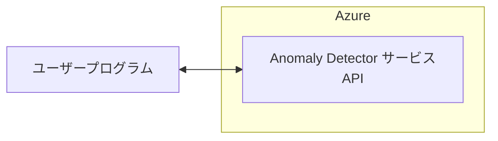
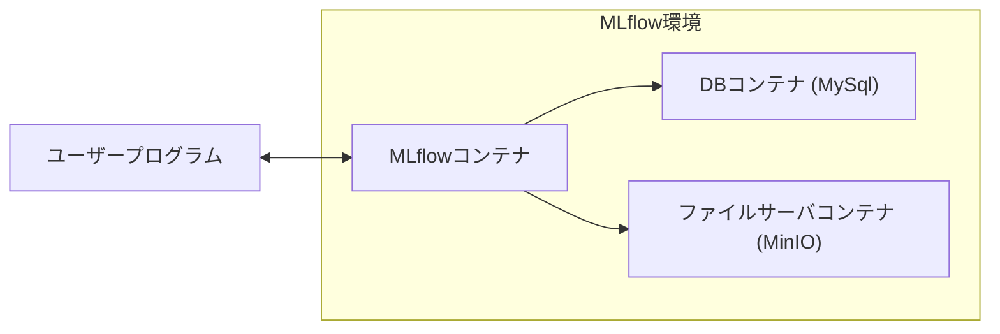

## はじめに

[Microsoft AzureのAnomaly Detector](https://learn.microsoft.com/ja-jp/azure/ai-services/anomaly-detector/overview)のサービスは、2026年10月1日で廃止されることが決まっています。
そのため、現在このサービスを利用しているシステムの利用者にとっては代替手段の検討が必要となっています。

この記事では、Anomaly DetectorをMLflowに置き換え、同様の異常検知を実施する方法についてサンプルコードを交えながら紹介します。
MLflowを活用することで、ローカル環境やクラウド上でも柔軟に異常検知が実施できます。

https://learn.microsoft.com/ja-jp/azure/ai-services/anomaly-detector/overview

### Azure Anomaly Detector APIとは

Azure Anomaly Detector APIは、時系列データの異常検出サービスです。
これにより、企業はデータ内の通常とは異なるパターンや異常値を検出し、早期の問題発見や予防策の実施が可能になります。
このAPIは、機械学習モデルを活用してデータの正常な範囲を自動で判断し、事前にトレーニングを必要とせずに異常を検出します。

Anomaly Detectorの主な特徴としては以下が挙げられ、システムの異常監視や予測的なメンテナンス、ユーザー行動の分析などに役立てられます。

- **リアルタイム異常検出**：リアルタイムデータでの異常検出が可能です。
- **カスタムモデルのトレーニング**：ユーザーの特定のデータセットに適したモデルを作成し、精度を高めることができます。
- **柔軟なデプロイ**：クラウドでの使用やローカルデバイスでの使用も可能です。

### MLflowとは

MLflowは、機械学習のライフサイクルを管理するためのオープンソースプラットフォームで、実験管理、モデルのデプロイ、再現可能な実験の追跡、モデルのレジストリ機能などが提供されているようです。
※ プラットフォームに依存しないため、ローカル環境、クラウド、オンプレミスでも利用可能です。

## 新旧実行環境の比較

「`Anomaly Detector`のサービスAPI」を使っている環境でデータを処理していた場合は以下になります。



代替案である`MLflow`を使ったときの環境でデータを処理する場合は以下になります。



## 実行環境およびディレクトリ構成

```text: ディレクトリ構成
MLflow-Docker
├── .devcontainer
│   ├── devcontainer.json
│   └── onCreateCommand.sh
├── app
│   └── test.py
├── mlflow
│   └── Dockerfile
├── minio
│   └── mlflow
├── mysql
│   └── data
├── Dockerfile
├── requirements.txt
├── requirements-dev.txt
└── docker-compose.yml
```

:::details `環境周りのソースコード`

```json: .devcontainer/devcontainer.json
{
  "name": "workspace",
  "dockerComposeFile": "../docker-compose.yml",
  "service": "workspace",
  "workspaceFolder": "/workspace",
  "customizations": {
    "vscode": {
      "extensions": [
        "ms-python.python",
        "ms-python.flake8",
        "ms-python.mypy-type-checker",
        "ms-python.black-formatter"
      ]
    }
  },
  "onCreateCommand": "/bin/sh .devcontainer/onCreateCommand.sh"
}
```

```bash: .devcontainer/onCreateCommand.sh
pip install --no-cache-dir --ignore-installed -r requirements-dev.txt
```

```txt: requirements.txt
time-series-anomaly-detector
mlflow
numpy
pandas
```

```dockerfile: Dockerfile
FROM python:3.12

RUN apt-get update && \
    apt-get -y install --reinstall ca-certificates && \
    apt-get -y install software-properties-common && \
    pip install --upgrade pip

# Install Basic Packages
COPY ./requirements.txt /workspace/requirements.txt
RUN pip install --no-cache-dir --ignore-installed -r /workspace/requirements.txt
```

```dockerfile: mlflow/Dockerfile
FROM python:3.12

RUN pip install -U pip && \
    pip install --no-cache-dir mlflow mysqlclient boto3
```

```yaml: docker-compose.yml
services:
  # app
  workspace:
    build:
      context: .
      dockerfile: Dockerfile
    volumes:
      - ./:/workspace/
    command: sleep infinity
    networks:
      - mlflow-net

  # MLflow
  mlflow:
    build:
      context: mlflow
      dockerfile: Dockerfile
    depends_on:
      - db
      - minio
    environment:
      TZ: Asia/Tokyo
      VIRTUAL_HOST: "localhost"
      MLFLOW_S3_ENDPOINT_URL: http://minio:9000
      AWS_ACCESS_KEY_ID: mlflow-minio
      AWS_SECRET_ACCESS_KEY: mlflow-minio
    command: >
      mlflow server --backend-store-uri 'mysql+mysqldb://mlflow:mlflow@db:3306/mlflow'
      --artifacts-destination 's3://mlflow/artifacts' --serve-artifacts --host 0.0.0.0 --port 80
    networks:
      - mlflow-net

  db:
    image: mysql:8.0.29
    restart: unless-stopped
    environment:
      MYSQL_USER: mlflow
      MYSQL_PASSWORD: mlflow
      MYSQL_ROOT_PASSWORD: mlflow
      MYSQL_DATABASE: mlflow
      TZ: Asia/Tokyo
    cap_add:
      # https://github.com/docker-library/mysql/issues/422
      - SYS_NICE
    volumes:
      - ./mysql/data:/var/lib/mysql
      - ./mysql/my.cnf:/etc/mysql/conf.d/my.cnf
    networks:
      - mlflow-net

  # S3互換のストレージ
  minio:
    image: minio/minio
    restart: unless-stopped
    volumes:
      - ./minio:/export
    environment:
      MINIO_ACCESS_KEY: mlflow-minio
      MINIO_SECRET_KEY: mlflow-minio
    command: server /export
    networks:
      - mlflow-net

  # minioコンテナ起動時にデフォルトのバケットを自動作成する
  defaultbucket:
    image: minio/mc
    depends_on:
      - minio
    entrypoint: >
      /bin/sh -c "
      until (/usr/bin/mc config host add minio http://minio:9000 mlflow-minio mlflow-minio) do echo 'try to create buckets...' && sleep 1; done;
      /usr/bin/mc mb minio/mlflow;
      /usr/bin/mc policy download minio/mlflow;
      exit 0;
      "
    networks:
      - mlflow-net

networks:
  mlflow-net:
    driver: bridge
```

:::

## 実行コード

サンプルコードには多変量解析などのテストコードがありますが、今回は単変量解析のテストコードを試していきます。
実行は`python app/test.py`で実行可能です。

```python: app/test.py
# 必要なライブラリをインポート
import mlflow
import numpy as np
import pandas as pd
from anomaly_detector import EntireAnomalyDetector
from mlflow.models import infer_signature

# MLflowのトラッキングURIを設定
mlflow.set_tracking_uri(uri="http://mlflow")


def main():
    # MLflowのエクスペリメントを指定
    mlflow.set_experiment("MLflow Quickstart 2")

    # 異常検知モデルのパラメータ設定
    params = {
        "granularity": "monthly",  # データの粒度（ここでは月次）
        "maxAnomalyRatio": 0.25,  # 異常の最大比率
        "sensitivity": 95,  # 異常検知の感度
        "imputeMode": "auto"  # 欠損値の補完モード
    }

    # MLflowランの開始
    with mlflow.start_run():
        mlflow.log_params(params)  # パラメータをログに記録
        mlflow.set_tag("Training Info", "Univariate Anomaly Detector")

        # 異常検知モデルのインスタンス作成
        model = EntireAnomalyDetector()

        # モデルのシグネチャを推論
        signature = infer_signature(params=params)

        # モデルをMLflowでログし、アーティファクトを保存
        model_info = mlflow.pyfunc.log_model(
            python_model=model,
            artifact_path="uvad_artifacts",  # モデルアーティファクトの保存先
            registered_model_name="tracking-quickstart",  # モデル名の指定
            signature=signature,  # モデルのシグネチャ
        )

    # モデルのURIを出力
    print(model_info.model_uri)

    # ログしたモデルをロード
    loaded_model = mlflow.pyfunc.load_model(model_info.model_uri)

    # 評価データの作成（最後の値のみ異常値に設定）
    eval_data = np.ones(20)
    eval_data[-1] = 0  # 異常な値を挿入
    eval_data = pd.DataFrame(eval_data, columns=["value"])
    timestamps = pd.date_range(start="1962-01-01", periods=20, freq="ME")
    eval_data["timestamp"] = timestamps

    # モデルで異常検知を実行
    results = loaded_model.predict(
        data=eval_data,
        params=params,
    )

    # 結果を出力
    print("---------------- 評価データ ----------------")
    print(eval_data)
    print("---------------- 評価データ ----------------")
    print("---------------- 結果 ----------------")
    print(results)
    print("---------------- 結果 ----------------")


# メイン関数の実行
if __name__ == "__main__":
    main()
```

:::details `実行結果`

```json
[
    {
        "timestamp": Timestamp("1962-01-31 00:00:00"),
        "result": {
            "expected_value": 0.9999999999999996,
            "upper_margin": 8.881784197001252e-16,
            "lower_margin": 0.04999999999999993,
            "is_negative_anomaly": False,
            "is_positive_anomaly": False,
            "is_anomaly": False,
            "period": 0
        }
    },
    {
        "timestamp": Timestamp("1962-02-28 00:00:00"),
        "result": {
            "expected_value": 0.9999999999999997,
            "upper_margin": 7.771561172376096e-16,
            "lower_margin": 0.04999999999999993,
            "is_negative_anomaly": False,
            "is_positive_anomaly": False,
            "is_anomaly": False,
            "period": 0
        }
    },
    {
        "timestamp": Timestamp("1962-03-31 00:00:00"),
        "result": {
            "expected_value": 0.9999999999999997,
            "upper_margin": 7.771561172376096e-16,
            "lower_margin": 0.04999999999999993,
            "is_negative_anomaly": False,
            "is_positive_anomaly": False,
            "is_anomaly": False,
            "period": 0
        }
    },
    {
        "timestamp": Timestamp("1962-04-30 00:00:00"),
        "result": {
            "expected_value": 0.9999999999999998,
            "upper_margin": 6.661338147750939e-16,
            "lower_margin": 0.050000000000000044,
            "is_negative_anomaly": False,
            "is_positive_anomaly": False,
            "is_anomaly": False,
            "period": 0
        }
    },
    {
        "timestamp": Timestamp("1962-05-31 00:00:00"),
        "result": {
            "expected_value": 0.9999999999999999,
            "upper_margin": 5.551115123125783e-16,
            "lower_margin": 0.04999999999999993,
            "is_negative_anomaly": False,
            "is_positive_anomaly": False,
            "is_anomaly": False,
            "period": 0
        }
    },
    {
        "timestamp": Timestamp("1962-06-30 00:00:00"),
        "result": {
            "expected_value": 1.0,
            "upper_margin": 4.440892098500626e-16,
            "lower_margin": 0.050000000000000044,
            "is_negative_anomaly": False,
            "is_positive_anomaly": False,
            "is_anomaly": False,
            "period": 0
        }
    },
    {
        "timestamp": Timestamp("1962-07-31 00:00:00"),
        "result": {
            "expected_value": 1.0,
            "upper_margin": 4.440892098500626e-16,
            "lower_margin": 0.050000000000000044,
            "is_negative_anomaly": False,
            "is_positive_anomaly": False,
            "is_anomaly": False,
            "period": 0
        }
    },
    {
        "timestamp": Timestamp("1962-08-31 00:00:00"),
        "result": {
            "expected_value": 1.0000000000000002,
            "upper_margin": 2.220446049250313e-16,
            "lower_margin": 0.050000000000000044,
            "is_negative_anomaly": False,
            "is_positive_anomaly": False,
            "is_anomaly": False,
            "period": 0
        }
    },
    {
        "timestamp": Timestamp("1962-09-30 00:00:00"),
        "result": {
            "expected_value": 1.0000000000000004,
            "upper_margin": 0.0,
            "lower_margin": 0.050000000000000044,
            "is_negative_anomaly": False,
            "is_positive_anomaly": False,
            "is_anomaly": False,
            "period": 0
        }
    },
    {
        "timestamp": Timestamp("1962-10-31 00:00:00"),
        "result": {
            "expected_value": 1.0000000000000004,
            "upper_margin": 0.0,
            "lower_margin": 0.050000000000000044,
            "is_negative_anomaly": False,
            "is_positive_anomaly": False,
            "is_anomaly": False,
            "period": 0
        }
    },
    {
        "timestamp": Timestamp("1962-11-30 00:00:00"),
        "result": {
            "expected_value": 1.0000000000000004,
            "upper_margin": 0.0,
            "lower_margin": 0.050000000000000044,
            "is_negative_anomaly": False,
            "is_positive_anomaly": False,
            "is_anomaly": False,
            "period": 0
        }
    },
    {
        "timestamp": Timestamp("1962-12-31 00:00:00"),
        "result": {
            "expected_value": 1.0000000000000002,
            "upper_margin": 2.220446049250313e-16,
            "lower_margin": 0.050000000000000044,
            "is_negative_anomaly": False,
            "is_positive_anomaly": False,
            "is_anomaly": False,
            "period": 0
        }
    },
    {
        "timestamp": Timestamp("1963-01-31 00:00:00"),
        "result": {
            "expected_value": 1.0,
            "upper_margin": 4.440892098500626e-16,
            "lower_margin": 0.050000000000000044,
            "is_negative_anomaly": False,
            "is_positive_anomaly": False,
            "is_anomaly": False,
            "period": 0
        }
    },
    {
        "timestamp": Timestamp("1963-02-28 00:00:00"),
        "result": {
            "expected_value": 1.0,
            "upper_margin": 4.440892098500626e-16,
            "lower_margin": 0.050000000000000044,
            "is_negative_anomaly": False,
            "is_positive_anomaly": False,
            "is_anomaly": False,
            "period": 0
        }
    },
    {
        "timestamp": Timestamp("1963-03-31 00:00:00"),
        "result": {
            "expected_value": 1.0000000000000002,
            "upper_margin": 2.220446049250313e-16,
            "lower_margin": 0.050000000000000044,
            "is_negative_anomaly": False,
            "is_positive_anomaly": False,
            "is_anomaly": False,
            "period": 0
        }
    },
    {
        "timestamp": Timestamp("1963-04-30 00:00:00"),
        "result": {
            "expected_value": 1.0000000000000002,
            "upper_margin": 2.220446049250313e-16,
            "lower_margin": 0.050000000000000044,
            "is_negative_anomaly": False,
            "is_positive_anomaly": False,
            "is_anomaly": False,
            "period": 0
        }
    },
    {
        "timestamp": Timestamp("1963-05-31 00:00:00"),
        "result": {
            "expected_value": 1.0000000000000002,
            "upper_margin": 2.220446049250313e-16,
            "lower_margin": 0.050000000000000044,
            "is_negative_anomaly": False,
            "is_positive_anomaly": False,
            "is_anomaly": False,
            "period": 0
        }
    },
    {
        "timestamp": Timestamp("1963-06-30 00:00:00"),
        "result": {
            "expected_value": 1.0,
            "upper_margin": 4.440892098500626e-16,
            "lower_margin": 0.050000000000000044,
            "is_negative_anomaly": False,
            "is_positive_anomaly": False,
            "is_anomaly": False,
            "period": 0
        }
    },
    {
        "timestamp": Timestamp("1963-07-31 00:00:00"),
        "result": {
            "expected_value": 1.0,
            "upper_margin": 4.440892098500626e-16,
            "lower_margin": 0.050000000000000044,
            "is_negative_anomaly": False,
            "is_positive_anomaly": False,
            "is_anomaly": False,
            "period": 0
        }
    },
    {
        "timestamp": Timestamp("1963-08-31 00:00:00"),
        "result": {
            "expected_value": 1.0,
            "upper_margin": 4.440892098500626e-16,
            "lower_margin": 0.050000000000000044,
            "is_negative_anomaly": True,
            "is_positive_anomaly": False,
            "is_anomaly": True,
            "period": 0
        }
    }
]
```

:::

## おわりに

今回は[Microsoft AzureのAnomaly Detector](https://learn.microsoft.com/ja-jp/azure/ai-services/anomaly-detector/overview)のサービスの代替方法を試してみました。
MLflowを使うことでAnomaly Detectorの置き換えができそうです。

サンプルコードは単変量解析を試してみましたが、多変量解析もサンプルコードが公開されています。
時間があれば、こちらも今後試していきます。

https://github.com/microsoft/anomaly-detector/blob/main/tests/e2e_test_mvad.py

## 参考

https://github.com/microsoft/anomaly-detector

https://github.com/mjun0812/MLflow-Docker
