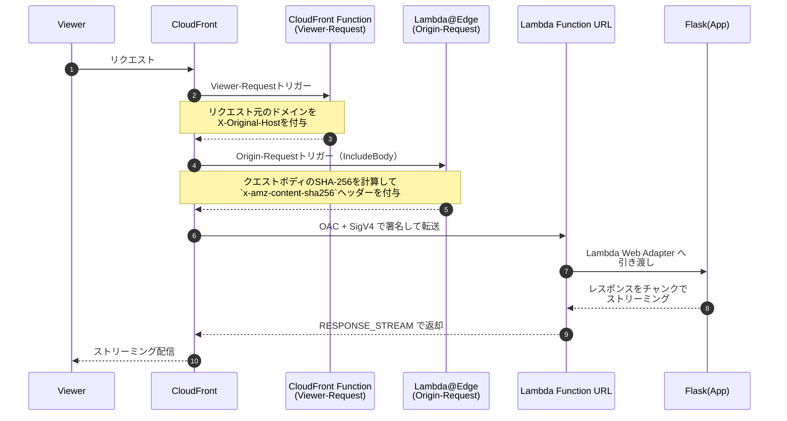

## はじめに

CloudFrontをオリジンにLambda Function URLを据え、Lambda Web AdapterでFlaskを動かし、レスポンスストリーミングでJSONを配信する構成を説明する。
本記事では、サンプルのデプロイからCloudFront経由でJSONを逐次受け取るところまでを案内する。

※ 備忘録のため、各サービスの詳細などは割愛してます。

## 主な使いどころ

- 長時間処理の進捗や部分結果の逐次返却
- 軽量なオンデマンド・ストリーム
  - Lambdaの同期レスポンスで話題になる「6MB上限」の制約を実質チャンク送出で回避でき、クライアントへ逐次送信できます。
  - ただし巨大ファイル配布の用途には不向きです（数十MB程度より大きな静的な大容量配布はS3の署名付きURL等を推奨します）。

## 構成


- CloudFront:
  - CloudFront Functionを使って「リクエスト元のドメインを付与」
  - Lambda@Edgeを使って「クエストボディのSHA-256を計算して`x-amz-content-sha256`ヘッダーを付与」
- Viewer-Requestで`Host`は保持したまま、`X-Original-Host`を付与
- Lambda側はレスポンスストリーミングを有効化
- Origin-Requestでを関連付け（IncludeBody: true）

## フロー

全体のリクエスト〜レスポンスの流れを示します。



## サンプル構成

- テンプレート(Lambda@Edge): `template_le.yaml`
- テンプレート(Lambda + CloudFront): `template.yaml`
- コンテナ: `app/Dockerfile`（AWS Lambda Web Adapter同梱）
- アプリ: `app/app.py`（Flask + JSONストリーミング）
- パッケージ: `app/requirements.txt`

:::details `template_le.yaml の役割（Lambda@Edge）`

```yaml: template_le.yaml
Description: Lambda@Edge (origin-request, IncludeBody) to add x-amz-content-sha256

Resources:
  EdgeHasherFn:
    Type: AWS::Serverless::Function
    Properties:
      Runtime: nodejs18.x
      Handler: index.handler
      InlineCode: |
        'use strict';
        const crypto = require('crypto');
        exports.handler = async (event, _ctx, cb) => {
          const req = event.Records[0].cf.request;
          if (!req.body || !req.body.data) return cb(null, req);
          const enc = req.body.encoding || 'base64';
          let raw;
          if (enc === 'base64') {
            raw = Buffer.from(req.body.data, 'base64');
          } else {
            raw = Buffer.from(req.body.data, 'utf8');
            req.body.data = raw.toString('base64');
            req.body.encoding = 'base64';
          }
          const hashHex = crypto.createHash('sha256').update(raw).digest('hex');
          req.headers['x-amz-content-sha256'] = [{ key: 'x-amz-content-sha256', value: hashHex }];
          return cb(null, req);
        };
  EdgeHasherFnVersion:
    Type: AWS::Lambda::Version
    Properties:
      FunctionName: !Ref EdgeHasherFn

Outputs:
  EdgeHasherFunctionVersionArn:
    Description: Published version ARN for CloudFront association
    Value: !Ref EdgeHasherFnVersion
```

ポイント: Lambda@Edgeはus-east-1でバージョン（$LATEST以外）を発行し、CloudFrontの`origin-request`（IncludeBody:true）に関連付ける。これにより、リクエストボディのSHA-256を計算して`x-amz-content-sha256`ヘッダーを付与し、OACの署名要件を満たす。

:::

:::details `template.yaml （Function URL + CloudFront OAC）`

```yaml: template.yaml
Parameters:
  EdgeHasherFunctionVersionArn:
    Type: String
    Description: 'us-east-1で発行した Lambda@Edge の バージョンARN'

Globals:
  Function:
    Timeout: 10
    MemorySize: 256

Resources:
  FlaskFunction:
    Type: AWS::Serverless::Function
    Properties:
      PackageType: Image
      Environment:
        Variables:
          PORT: "8080"
          AWS_LWA_INVOKE_MODE: "response_stream"
          AWS_LWA_LOG_LEVEL: "debug"
          RUST_BACKTRACE: "1"
      FunctionUrlConfig:
        AuthType: AWS_IAM
        InvokeMode: RESPONSE_STREAM
    Metadata:
      Dockerfile: Dockerfile
      DockerContext: ./app
      DockerTag: python3.12-lwa

  OriginalHostFunc:
    Type: AWS::CloudFront::Function
    Properties:
      Name: OriginalHostHeader
      AutoPublish: true
      FunctionConfig:
        Comment: Copy viewer Host to X-Original-Host
        Runtime: cloudfront-js-2.0
      FunctionCode: |
        function handler(event) {
          var req = event.request;
          if (req.headers && req.headers.host && req.headers.host.value) {
            req.headers['x-original-host'] = { value: req.headers.host.value };
          }
          return req;
        }

  ForwardOriginalHost:
    Type: AWS::CloudFront::OriginRequestPolicy
    Properties:
      OriginRequestPolicyConfig:
        Name: ForwardOriginalHost
        Comment: Forward X-Original-Host to Lambda Function URL
        HeadersConfig:
          HeaderBehavior: whitelist
          Headers:
            - X-Original-Host
        CookiesConfig:
          CookieBehavior: none
        QueryStringsConfig:
          QueryStringBehavior: all

  LambdaOAC:
    Type: AWS::CloudFront::OriginAccessControl
    Properties:
      OriginAccessControlConfig:
        Name: LambdaOAC
        Description: OAC for Lambda Function URL
        OriginAccessControlOriginType: lambda
        SigningBehavior: always
        SigningProtocol: sigv4

  Distribution:
    Type: AWS::CloudFront::Distribution
    Properties:
      DistributionConfig:
        Enabled: true
        HttpVersion: http2and3
        PriceClass: PriceClass_100
        Origins:
          - Id: LambdaFunctionOrigin
            DomainName: !Select [2, !Split ['/', !GetAtt FlaskFunctionUrl.FunctionUrl]]
            CustomOriginConfig:
              OriginProtocolPolicy: https-only
              HTTPSPort: 443
              OriginSSLProtocols: [ TLSv1.2 ]
            OriginAccessControlId: !Ref LambdaOAC
        DefaultCacheBehavior:
          TargetOriginId: LambdaFunctionOrigin
          ViewerProtocolPolicy: redirect-to-https
          AllowedMethods: [HEAD, DELETE, POST, GET, OPTIONS, PUT, PATCH]
          CachePolicyId: 4135ea2d-6df8-44a3-9df3-4b5a84be39ad # Managed-CachingDisabled
          OriginRequestPolicyId: !Ref ForwardOriginalHost
          FunctionAssociations:
            - EventType: viewer-request
              FunctionARN: !GetAtt OriginalHostFunc.FunctionMetadata.FunctionARN
          LambdaFunctionAssociations:
            - EventType: origin-request
              IncludeBody: true
              LambdaFunctionARN: !Ref EdgeHasherFunctionVersionArn

  AllowCloudFrontInvokeFunctionUrl:
    Type: AWS::Lambda::Permission
    Properties:
      Action: lambda:InvokeFunctionUrl
      FunctionName: !GetAtt FlaskFunction.Arn
      Principal: cloudfront.amazonaws.com
      FunctionUrlAuthType: AWS_IAM
      SourceArn: !Sub arn:aws:cloudfront::${AWS::AccountId}:distribution/${Distribution}
```

:::

:::details `Dockerfile （Lambda Web Adapterを同梱）`

```dockerfile: app/Dockerfile
FROM public.ecr.aws/docker/library/python:3.12.1-slim
COPY --from=public.ecr.aws/awsguru/aws-lambda-adapter:0.9.1 /lambda-adapter /opt/extensions/lambda-adapter

WORKDIR /var/task
COPY requirements.txt .
RUN python -m pip install -r requirements.txt

COPY app.py ./

ENV PORT=8080
CMD ["gunicorn", "-b=:8080", "-w=1", "--threads", "4", "--keep-alive", "60", "app:app"]
```

:::

:::details `Flask （JSONを逐次ストリーミング）`

```python: app/app.py
from flask import Flask, Response, request
import json, time

app = Flask(__name__)


def iter_json():
    # 開始イベント
    yield json.dumps({"event": "start", "message": "streaming begin"}) + "\n"
    time.sleep(0.5)

    # データを分割して返却
    test_data = ["Hello", " ", "World", "!"]
    for idx, token in enumerate(test_data):
        yield json.dumps({"event": "data", "index": idx, "token": token}) + "\n"
        time.sleep(0.3)

    # 終了イベント
    yield json.dumps({"event": "end", "message": "done"}) + "\n"


@app.route('/', methods=['GET', 'POST'])
def root():
    viewer_host = request.headers.get("X-Original-Host", "") or "unknown"

    response = Response(iter_json(), mimetype="application/json")
    response.headers["X-AggregateInfo-Result"] = "OK"
    response.headers["X-Request-Host"] = viewer_host
    return response
```

:::

## デプロイ

1. Lambda@Edgeをus-east-1にデプロイ（`template_le.yaml`）

```bash
sam build -t template_le.yaml
sam deploy -t template_le.yaml \
  --region us-east-1 \
  --stack-name edge-hasher

# 出力のEdgeHasherFunctionVersionArnを控える
```

2. CloudFront + Function URLをデプロイ（`template.yaml`）

```bash
sam build -t template.yaml
sam deploy -t template.yaml \
  --region ap-northeast-1 \
  --stack-name sample-lambda-function-url \
  --parameter-overrides EdgeHasherFunctionVersionArn="<上で出力されたVersion ARN>"
```

## 動作確認

以下のようにシンプルなリクエストすることで、逐次JSONを受け取れます。

```bash
curl -X GET \
  -o test.json \
  https://<CloudFrontDomain>/

# もしくは
curl -X POST \
  -o test.json \
  https://<CloudFrontDomain>/
```

例: `test.json` の先頭数行（逐次追記される）

```text
{"event":"start","message":"streaming begin"}
{"event":"data","index":0,"token":"Hello"}
{"event":"data","index":1,"token":" "}
...（中略）...
{"event":"end","message":"done"}
```

## 実装の要点

- Lambda Web Adapter設定（テンプレート/コンテナ）
  - 環境変数: `AWS_LWA_INVOKE_MODE=response_stream`
  - Function URL: `InvokeMode: RESPONSE_STREAM`
- Hostの扱い
  - CloudFront Functionで `X-Original-Host` を付与し、アプリ側で参照。
- Flaskのレスポンス: `Response(iter_json(...))`でJSONを逐次返却（`app/app.py`）。

## おわりに

CloudFrontとLambda Function URLを組み合わせることで、サーバレスかつシンプルな構成でストリーミング配信が可能になります。
Lambda Web Adapterを使うことで、既存のPython Webアプリ（Flaskなど）も活用しやすくなります。

## 参考

https://github.com/awslabs/aws-lambda-web-adapter/tree/main/examples/flask

https://dev.classmethod.jp/articles/aws-lambda-can-streaming-response/

https://michimani.net/post/aws-lambda-function-urls-with-custom-domain/
