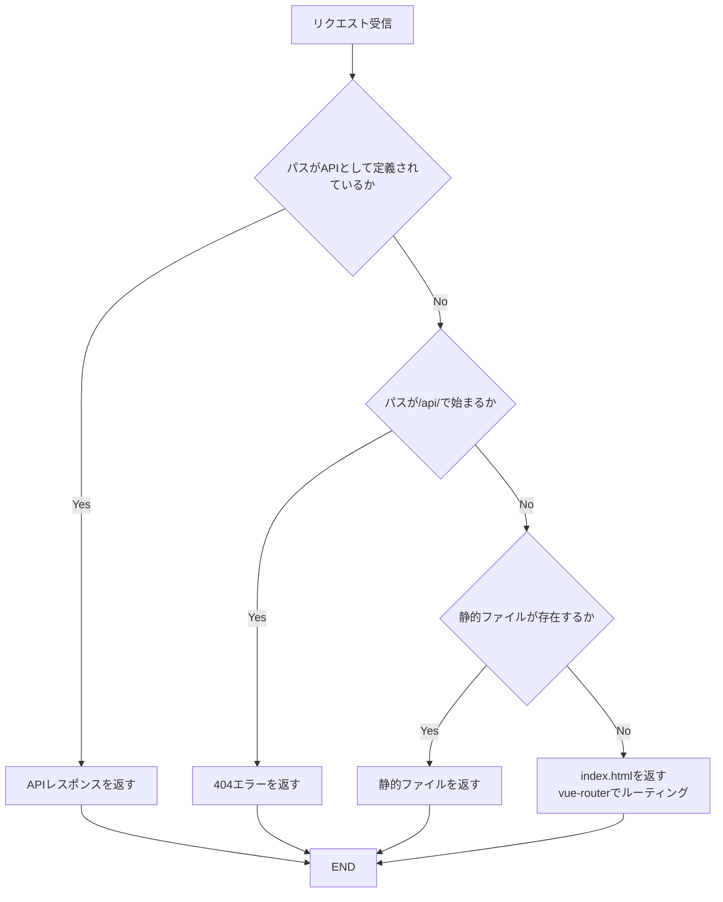
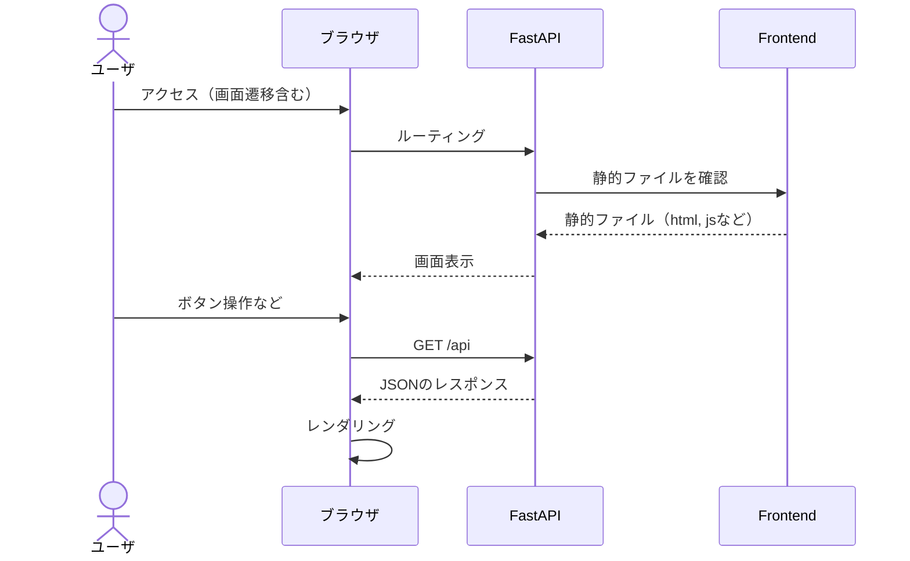

## はじめに

本記事では、FastAPIとVue3を組み合わせて、フロントエンドのルーティングをFastAPI側で管理する方法について解説します。
このアプローチにより、シンプルな構成でSPA（Single Page Application）の構築が可能になります。

本記事ではFastAPIやVueについては説明を省略してます。FastAPIは以下のZennの本がわかりやすいので、オススメです。

https://zenn.dev/sh0nk/books/537bb028709ab9

## FastAPIでフロントエンドのルーティングを管理する

以下のソースコードを用いて、FastAPIがフロントエンドのルーティングを管理する方法を説明します。

:::details `ディレクトリ構成`

- server.py
- frontend（フロントエンド関連）
    - dist（ビルドされたファイルが格納される）

:::

```python: server.py
import os
import re

from fastapi import FastAPI, HTTPException, status
from fastapi.responses import FileResponse

app = FastAPI()


# APIのルーティングサンプル
@app.get("/api")
def read_root():
    return {"Hello": "World"}


# 静的ファイル(SPA: Vue3)のルーティング
@app.get("/{path:path}")
async def catch_all(path: str):
    dist_path = path

    # 定義されていないAPIは404(Not Found)を返す
    if re.match("api/", path):
        raise HTTPException(
            status_code=status.HTTP_404_NOT_FOUND,
            detail="Not Found",
        )

    # distに存在しないファイルは、Vueのルーターに任せるため、index.htmlを返す
    if not os.path.isfile(os.path.join("frontend/dist/", path)):
        dist_path = "index.html"

    return FileResponse(os.path.join("frontend/dist/", dist_path))
```

### 解説

このコードは、FastAPIがバックエンドAPIとして機能するだけでなくVue3で構築されたフロントエンドの静的ファイルを提供する役割も果たします。
上記のコードで仕組み化されている内容は、以下のフローで示すことができます。



#### 実装時にハマったこと

以下で静的なファイルとしてマウントした場合、`/xxxx`に対してブックマークなどから直接アクセスした際にはどのパスにも一致せず404エラーになります。
frontend/dist/xxxxにはファイルはindex.htmlやjsファイルもないためです。
本記事のコードは、存在しない場合は`frontend/dist/index.html`を返して`vue-router`でルーディングをさせています。

```python
from fastapi.staticfiles import StaticFiles

app.mount("/", StaticFiles(directory="frontend/dist", html=True), name="html")
```

#### クライアントとのやりとり

以下のシーケンス図は、クライアントとFastAPI(+Vue)のやり取りを表しています。



## おわりに

FastAPIを用いたバックエンドとVue3によるフロントエンドの統合はシンプルかつ柔軟性の高いアプローチです。
本記事で紹介した方法を活用することで、効率的なSPAの開発が可能になります。

## 参考

https://fastapi.tiangolo.com/ja/

https://router.vuejs.org/

https://qiita.com/sand/items/4b3e222dbb9315e2b0c0
