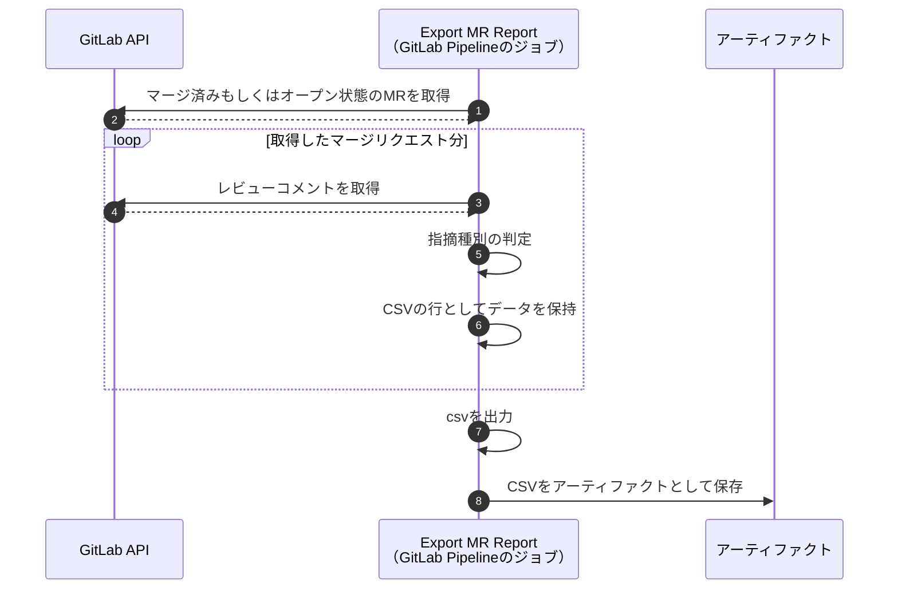

## はじめに

CI/CDカタログについては、[こちら](./gitlab_cicd_components)で簡単にまとめてみました。
この記事ではCI/CDカタログとして、マージリクエストからコメントを抽出できる「Export MR Report」を実際に作ったものを紹介します。

https://gitlab.com/selectionselection/components/export-mr-report

https://gitlab.com/explore/catalog/selectionselection/components/export-mr-report

## Export MR Report

今回作った機能は、マージリクエストからコメントを抽出して分析用のCSVを出力するCICDカタログです。
出力されたCSVはジョブのアーティファクトとして保存され、ダウンロードできます。

さらに、[コードレビューの心理的安全を高めるためにラベルを付ける方法](https://zenn.dev/hacobell_dev/articles/code-review-comment-prefix)がありますが、どのラベルが付けられているかも出力されます。
それによって、「ラベルを適切に運用できているか」を分析できることを期待しています。



### 実行結果

出力されるCSVは以下のデータ形式で出力されます。

| カラム名 | 概要 |
| ----- | ----- |
| タイトル(MR) | マージリクエストのタイトル |
| 担当者 | マージリクエストの担当者 |
| レビュアー | マージリクエストのレビュアー |
| 承認者 | マージリクエストを承認した人 |
| Comment URL | コメントのURL |
| コメントした人 | レビュー指摘をした人 |
| コード位置 | コメント箇所 |
| コメント | コメントの内容 |
| 指摘種別 | 指摘の種別 |

#### 指摘種別のラベル

| ラベル | 意味 | 意図 |
| ----- | ----- | ----- |
| Q | 質問 (Question) | 質問。相手は回答が必要 |
| FYI | 参考まで (For your information) | 参考までに共有。アクションは不要 (確認事項を残す場合などに使用) |
| NITS | あら捜し (Nitpick) | 重箱の隅をつつく提案。無視しても良い |
| NR | お手すきで (No rush) | 今やらなくて良いが、将来的には解決したい提案。タスク化や修正を検討 |
| IMO | 提案 (In my opinion) | 個人的な見解や、軽微な提案。タスク化や修正を検討 |
| MUST | 必須 (Must) | これを直さないと承認できない。修正を検討 |

##### 参考

https://zenn.dev/hacobell_dev/articles/code-review-comment-prefix

#### サンプル

```csv
"タイトル(MR)","担当者","レビュアー","承認者","Comment URL","コメントした人","コード位置","コメント","指摘種別"
"Update file README.md","None","None","None","https://gitlab.com/selectionselection/components/export-mr-report/-/merge_requests/1#note_1918652534","hijiri umemoto","README.md:9","[Q]\n\nパーソナルアクセストークン（個人のアクセストークン）なら不要ということでよろしいでしょうか？","Q"
```

|タイトル(MR)|担当者|レビュアー|承認者|Comment URL|コメントした人|コード位置|コメント|指摘種別|
|--|--|--|--|--|--|--|--|--|
|Update file README.md|None|None|None|`Comment URL`|hijiri umemoto|README.md:9|[Q]\n\nパーソナルアクセストークン（個人のアクセストークン）なら不要ということでよろしいでしょうか|Q|

## CICDカタログ

カタログは以下で公開しています。

https://gitlab.com/explore/catalog/selectionselection/components/export-mr-report

### 使い方

後述している[事前準備](#事前準備)を実施後、`.gitlab-ci.yml`に以下を追記ください。

```yml
include:
  # - component: $CI_SERVER_FQDN/${グループ}/export-mr-report/export@~latest
  - component: $CI_SERVER_FQDN/selectionselection/components/export-mr-report/export@~latest
```

#### 事前準備

1. プロジェクト専用もしくは個人のアクセストークンを発行してください。
    - `Scopes`: `read_api`
    - `Select a role`: `Reporter` ※ プロジェクト専用時のみ
2. CI/CD Variablesに発行したトークンを設定してください。
    - `Visibility`: `Masked`
    - `Key`: `PRIVATE_TOKEN`
    - `Value`: 発行したトークン

## おわりに

今回はCICDカタログのサンプルとして、マージリクエストからコメントを抽出できる「Export MR Report」を実際に作ったものを紹介しました。
出力されたCSVには心理的安全性に関するラベルが適用されているかどうかの項目も存在します。

心理的安全性のラベルなどをコメントを出力することで、CSVを元にBIツールで分析できることを期待しています。
