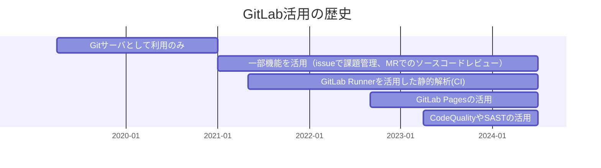

## はじめに

セカンドセレクション技術部のumemotoです。
この記事は、私のように[GitLab](https://about.gitlab.com/ja-jp/)を単なるGitサーバとしてしか使えなかった人に向けて
私が使ってみて設定のわりに効果があると感じている設定を紹介します。

- issueやMR(マージリクエスト)のテンプレート
- MR(マージリクエスト)を介したマージの強制
- マージリクエストの合格チェック
- CodeQualityやSAST

※ GitLabはオンプレかつ無償の`Community Edition`を利用することを想定した記事になってます。この時のGitLabのバージョンは`v16.3.1`です。

### 現在の社内のシステム構成

別の記事でも紹介してますが、弊社ではGitLabを社内ネットワーク上に構築してます。


### 弊社のGitLab活用の歴史

昔のことを思い出しながら書き出してます。
弊社のGitLab活用の歴史を見ていただいてわかる通り、割と使いこなせるまで４年かかってます。

ガントチャートなのは、mermaidでガントチャート書いてみたかっただけです。



各ポイントで以下のような試行錯誤・経緯があり、後述している設定を実施してます。

- 不具合報告のIssueの記載粒度がバラバラになっている
    - ⇒ [issueやMR(マージリクエスト)のテンプレート](#issueやmrマージリクエストのテンプレート)の導入
- ブランチに直接プッシュしてレビューの過程が飛ばされた（少人数でのプロジェクト）
    - ⇒ [MR(マージリクエスト)を介したマージの強制](#mrマージリクエストを介したマージの強制)の導入
- レビュー指摘の修正やパイプラインがOKのチェックなしにマージされる可能性があった
    - ⇒ [マージリクエストの合格チェック](#マージリクエストの合格チェック)の導入
- コードの品質評価や脆弱性の診断を簡易に実施したい
    - ⇒ [CodeQualityやSAST](#codequalityやsast)の導入

## issueやMR(マージリクエスト)のテンプレート

issueやMR(マージリクエスト)は、記載フォーマットを統一することでレビューなどが効率化されチームの生産性が向上します。

### issueやMR(マージリクエスト)のテンプレート_設定方法

`main`のブランチに以下のディレクトリとファイルを作ることで利用できます。
フォーマットはmarkdown形式になります。

- .gitlab
    - issue_templates
        - default.md
        - incident_critical.md(複数のテンプレートを準備できます)
    - merge_request_templates
        - default.md

※ MR(マージリクエスト)のテンプレートには`実装内容`や`レビュー観点`などを列挙しておくと👌。

### issueやMR(マージリクエスト)のテンプレート_動作

default.mdで設定したテンプレートの内容が初期表示されます。


さらに、テンプレートを複数指定しているのであれば、説明の選択肢からテンプレートを変更できます。例としてインシデント発生時のテンプレートがある場合を記載してます。


## MR(マージリクエスト)を介したマージの強制

GitLabに限ったことではありませんが、特定のブランチ(mainやproductなど)へプッシュされた際にパイプラインが実行され本番環境などにデプロイされる可能性があります。
そのため、保護ブランチへのプッシュ・マージはMR(マージリクエスト)を介して権限を持った者が実施すべきです。

GitLabではリポジトリの設定で保護ブランチのプッシュやマージを制限できます。

### MR(マージリクエスト)を介したマージの強制_設定方法

設定方法は以下になります。

1. プロジェクトのサイドバーから「設定⇒リポジトリ」を選択し、リポジトリの設定画面を開きます。  
    

2. ブランチによって運用が異なりますが、マージやプッシュはプロジェクト管理者`Maintainer`を指定しておきます（デフォルトでこの設定）
    - 例えば、GitLab-Flowでいう開発ブランチ`main`は開発者`Developer`も許可するという設定も可能です。

### MR(マージリクエスト)を介したマージの強制_動作

プロジェクト管理者`Maintainer`のみがマージできる場合、開発者`Developer`の画面では以下のようにマージはできません。


プロジェクト管理者`Maintainer`ではマージができるようになっています。


## マージリクエストの合格チェック

MR(マージリクエスト)でレビュー指摘をコメントした際、そのコメント（指摘事項）が解決するまでマージされないようにできる設定です。
コメント（指摘事項）の修正・確認漏れということを防ぐことができます。

### マージリクエストの合格チェック_設定方法

設定方法は以下になります。

1. プロジェクトのサイドバーから「設定⇒マージリクエスト」を選択し、マージリクエストの設定画面を開きます。  
    

2. 「マージチェック」の項目で以下にチェックを入れます。
    - 「すべてのスレッドが解決しなければなりません」
    - 「パイプラインは成功しなければなりません」
        - 静的解析や自動テストをパイプラインで実行するのであれば、こちらも設定する。
3. 「変更を保存」を押下することで、設定が保存されます。

### マージリクエストの合格チェック_動作

MR(マージリクエスト)では以下のように表示されてマージができないようになっています。


そして、指摘事項が修正されてレビュアーが解決済みとした場合にマージができるようになります。


## CodeQualityやSAST

GitLab Runnerを準備してパイプラインが実行できる環境であれば`CodeQuality`や`SAST`を簡単に実行できます。
`CodeQuality`はコードの品質評価を、`SAST`は脆弱性の診断やシークレット情報を含んでないかのチェックができます。
※ GitLab Runnerの構築方法は今回割愛してます。

### CodeQualityやSAST_設定方法

パイプラインの設定ファイル`.gitlab-ci.yaml`に以下のテンプレートを読み込む記載を追加するだけです。

`CodeQuality`は以下を設定します。

```yaml:.gitlab-ci.yml
include:
  - template: Code-Quality.gitlab-ci.yml

code_quality:
  rules:
    - if: $CODE_QUALITY_DISABLED
      when: never
    - if: $CI_PIPELINE_SOURCE == "merge_request_event"
    - if: $CI_COMMIT_BRANCH == $CI_DEFAULT_BRANCH
    - if: $CI_COMMIT_TAG

code_quality_html:
  extends: code_quality
  variables:
    REPORT_FORMAT: html
  artifacts:
    paths: [gl-code-quality-report.html]
    expire_in: 1 week
```

`SAST`は以下を設定します。`SAST`は複数のテンプレートがGitLabから提供されています。
今回は"シークレット情報を含んでないかのチェック"と"既知の脆弱性についてソースコードを分析"についての設定になります。

```yaml:.gitlab-ci.yml
include:
  - template: Security/SAST.gitlab-ci.yml
  - template: Security/Secret-Detection.gitlab-ci.yml
```

### CodeQualityやSAST_動作

`CodeQuality`はMR(マージリクエスト)に以下のように表示されます。


`SAST`はパイプラインの実行結果(アーティファクト)をダウンロードして確認します。
ライセンスによってはMR(マージリクエスト)に表示されるようですが、弊社は無償版を利用してるためダウンロードという形式取ってます。


## おわりに

セカンドセレクションに入社してからGitLabの運用・管理するまでの事を思い出しつつ、記事にしました。
２～３年でかなり有益な使い方ができるようになりましたが、今回紹介した機能も以下で一部となります。

- issueやMR(マージリクエスト)のテンプレート
- MR(マージリクエスト)を介したマージの強制
- マージリクエストの合格チェック
- CodeQualityやSAST

社内でももっと業務効率の改善にGitLabを活用していきたいです。
