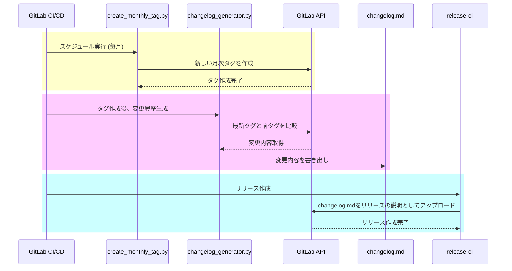

## はじめに

社内では`hugo`と`GitLab Pages`を使って[GitLab Handbook](https://handbook.gitlab.com/)に倣って社内ドキュメント（ハンドブック）を運用しています。
ただ、毎月1回のハンドブック更新を社内に通知するのは大切なのですが、手動で行うと時間と手間がかかります。

この記事では、GitLabを使って「ハンドブック更新を社内に通知する」プロセスを自動化する方法を紹介します。
Pythonスクリプトを使用し、GitLab CI/CDの設定で定期的にタグ付けと変更ログの生成して社内で共有する手順をまとめています。

## 準備

まず、GitLab APIを使うためにPythonパッケージの `python-gitlab` をインストールします。
また、GitLabのURL、APIトークン、プロジェクトIDなどを環境変数として設定する必要があります。

## スクリプト

今回作っていたスクリプトは以下のシーケンスで実行され、GitLabのissueとして変更ログを社内に共有できます。



### GitLab CI/CDの設定

上記のスクリプトを毎月実行するために、GitLab CI/CDの設定を以下のように行います。
この設定ファイルにより、GitLabのスケジュール機能を使って毎月のタグ作成と変更履歴の生成を自動化できます。

```yaml: .gitlab-ci.yml
# シーケンス図の黄色ブロック
create_monthly_tag:
  image: python:3.12
  stage: schedule
  rules:
    - if: $CI_PIPELINE_SOURCE == "schedule"
  before_script:
    - pip install python-gitlab
  script:
    - python create_monthly_tag.py
  tags:
    - scheduled

# シーケンス図の赤色ブロック
changelog:
  image: python:3.12
  stage: changelog
  before_script:
    - pip install python-gitlab
  script:
    - echo "$(python changelog_generator.py)" > changelog.md
  artifacts:
    paths:
      - changelog.md
  only:
    - tags
  tags:
    - scheduled

# シーケンス図の青色ブロック
release:
  image: registry.gitlab.com/gitlab-org/release-cli:latest
  stage: release
  needs: ["changelog"]
  before_script:
    - echo start release
  script:
    - CHANGELOG="$(cat changelog.md)"
    - release-cli create --name "Release $CI_COMMIT_TAG" --tag-name $CI_COMMIT_TAG --description="$CHANGELOG" --ref "$CI_COMMIT_SHA"
  only:
    - tags
  tags:
    - scheduled
```

### 1. 月次タグの作成

まず、毎月一度新しいタグをプロジェクトに付けて変更を記録するためのスクリプトを作成します。
このコードは、毎月の実行時に年と月を基にタグ（例: `202410`）を作成します。
このタグを使用して、次に紹介する変更履歴生成スクリプトが変更点を比較します。

```python: 月次タクの作成スクリプト
from datetime import datetime
import gitlab

def create_monthly_tag():
    gl = gitlab.Gitlab(URL, **TOKEN)
    project = gl.projects.get(id=PROJECT_ID)
    project.tags.create({
        "tag_name": datetime.today().strftime('%Y%m'),
        "ref": 'main'
    })

if __name__ == "__main__":
    create_monthly_tag()
```

### 2. 変更履歴を生成する

次に、ハンドブックの変更内容を自動で取得し、社内通知用のフォーマットにまとめるスクリプトです。
このスクリプトでは、変更されたマークダウンファイル（`.md`）の追加、変更、削除に分類し、簡単に見やすい形式で通知するためのフォーマットを生成します。

```python: 変更履歴を生成スクリプト
def generate_changelog_text():
    gl = gitlab.Gitlab(URL, **TOKEN)
    project = gl.projects.get(id=PROJECT_ID)
    tags = project.tags.list(get_all=True)
    newest_tag = tags[0]
    second_newest_tag = tags[1]

    compare = project.repository_compare(
        second_newest_tag.name,
        newest_tag.name
    )

    # マージリクエストのタイトルとURLを取得する
    commits_since_last_tag = compare["commits"]
    related_merged_requests = {}
    for commit in commits_since_last_tag:
        merge_requests = project.commits.get(commit["id"]).merge_requests()
        merge_requests = merge_requests if merge_requests is not None else []

        for mr in merge_requests:
            if mr["state"] == "merged":
                related_merged_requests[mr["id"]] = mr

    merged_log = "\n".join(
        [f"- [{mr['title']}]({mr['web_url']})" for mr in related_merged_requests.values()]
    ) if related_merged_requests else '- なし\n'

    # 修正差分ファイルを取得する
    file_log = ""
    diffs = compare["diffs"]
    if diffs:
        new_files = [f"- {df['new_path']}" for df in diffs if df['new_file']]
        update_files = [f"- {df['old_path']} ⇒ {df['new_path']}" for df in diffs if df['renamed_file']]
        delete_files = [f"- {df['old_path']}" for df in diffs if df['deleted_file']]

        file_log += "#### 追加\n\n" + ("\n".join(new_files) if new_files else "- 変更なし\n")
        file_log += "\n\n#### 変更\n\n" + ("\n".join(update_files) if update_files else "- 変更なし\n")
        file_log += "\n\n#### 削除\n\n" + ("\n".join(delete_files) if delete_files else "- 変更なし\n")
        file_log += "\n"

    print(template.format(
        newest_tag.name,
        merged_log,
        file_log
    ))
```

```md: 生成されたメッセージ
## yyyyMM

### 関連マージリクエスト

- [!Resolve "XXXXXXXXXXXXX"](http://xxxxxxxx.com/group/handbook/-/merge_requests/XX)
- [!Resolve "YYYYYYYYYYYYY"](http://xxxxxxxx.com/group/handbook/-/merge_requests/YY)

### 変更履歴

#### 追加

- content/docs/xxxxx.md

#### 変更

- content/docs/yyyyy.md

#### 削除

- 変更なし
```

### 3. 月次タグと変更内容からReleaseを作成

GitLabのReleaseを、提供されているイメージ`registry.gitlab.com/gitlab-org/release-cli`を使って作成します。

GitLab CI/CDの設定の下記の部分が作成するJobになります。

```yaml: .gitlab-ci.yml
release:
  image: registry.gitlab.com/gitlab-org/release-cli:latest
  stage: release
  needs: ["changelog"]
  before_script:
    - echo start release
  script:
    - CHANGELOG="$(cat changelog.md)"
    - release-cli create --name "Release $CI_COMMIT_TAG" --tag-name $CI_COMMIT_TAG --description="$CHANGELOG" --ref "$CI_COMMIT_SHA"
  only:
    - tags
  tags:
    - scheduled
```

## まとめ

この設定により、毎月のハンドブック更新が自動でタグ付けされ、変更内容が簡単に確認できるようになります。
定期的な更新情報をスムーズに社内共有するため、ぜひこの自動化プロセスを活用してみてください！
