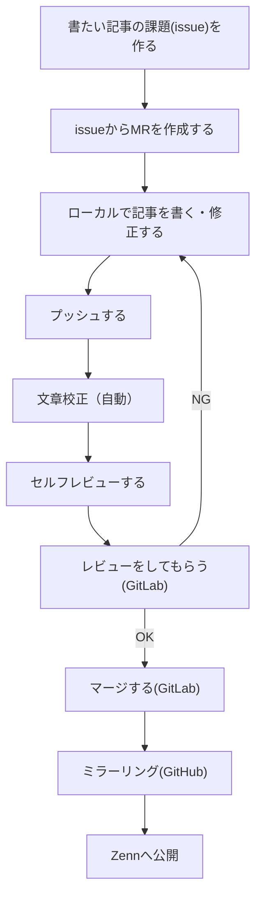

## はじめに

この記事は、zennで記事を投稿するにあって普段利用している[GitLab](https://about.gitlab.com/ja-jp/)で記事を管理・レビューする方法を検討・構築した内容を記載したものです。

## コンセプト

会社でzennの記事をアップするに当たってコンセプトとして、以下を考えました。
以降で"構成"や"執筆の流れ"について説明していきます。

- 普段の開発スタイルに近い環境・フローで記事を書く
- 文章校正はなるべく自動化する
- MR(マージリクエスト)を駆使して、レビューする

## 構成

zennに記事を投稿するまでの構成は以下のようになります。
コンセプト通り普段の開発スタイルに合わせて記事の管理やレビューについてはGitLabを利用し、
文章校正は[GitLab Runner](https://gitlab-docs.creationline.com/ee/ci/runners/)を用いてレビュー前に自動でチェックしてます。


### 設定方法

各種アカウントの登録などの説明は省きますが、必要なものは下記になります。

- zennアカウント
- Googleアカウント
- GitHubアカウント
- GitLabアカウント
  - 業務ではオンプレで構築・運用してます

簡単な手順は以下となります。

1. GitLabで記事管理用のリポジトリを作成します。
2. GitHubでもリポジトリを作成します。
3. GitLab⇒GitHubのミラーリングを設定します。
4. GitHubとzennの連携を設定します。

#### GitLabでリポジトリを作成

詳しくは公式ドキュメントをご覧ください。

https://gitlab-docs.creationline.com/ee/gitlab-basics/create-project.html

必要な機能としては`Issues`と`Repository`、`Merge requests`、`CI/CD`があれば十分です。


##### リポジトリの構成

https://github.com/ss-umemoto/zenn

構成要素の一部を抜粋して記載します。

- `.devcontainer`(VSCode Dev Containerの設定)
- `.gitlab`
  - `issue_templates`(Issueのテンプレート)
  - `merge_request_templates`(MRのテンプレート)
- `.gitlab-ci.yml`(CIの設定)
- `articles`(zennの記事管理)
- `books`(zennの本管理)
- `.textlintrc.json`(文章校正の設定)
- `package.json`(パッケージ管理ファイル)

文章校正としては`textlint`でよくある３つのルールを利用してます。

- preset-ja-spacing
- preset-ja-technical-writing
- spellcheck-tech-word

```json:.textlintrc.json
{
  "plugins": {},
  "filters": {},
  "rules": {
    "preset-ja-spacing": true,
    "preset-ja-technical-writing": true,
    "spellcheck-tech-word": true
  }
}
```

CIの設定としては上記の`textlint`を"GitLab Runner"で実施してます。

```yml:.gitlab-ci.yml
variables:
  REVIEWDOG_GITLAB_API_TOKEN: ${REVIEWDOG_GITLAB_API_TOKEN}

stages:
  - linting

textlint:
  stage: linting
  image: node:latest
  script:
    - yarn install
    - wget -O - -q https://raw.githubusercontent.com/reviewdog/reviewdog/master/install.sh | sh -s
    - yarn textlint -f checkstyle ./articles/ ./books/ | bin/reviewdog -f=checkstyle -name="textlint" -reporter=gitlab-mr-discussion
```

REVIEWDOG_GITLAB_API_TOKENには別途パーソナルアクセストークンを生成して、CIの"Variable"に設定してください。

###### パーソナルアクセストークン


###### CI"Variable"の設定


MRで`textlint`の指摘が合った場合には以下のようにコメントされます。
会社では犬のアイコンの別ユーザがコメントしてくれます（少しは癒されます）


#### GitHubでリポジトリを作成

詳しくは公式ドキュメントをご覧ください。
コードはGitLabで管理するので、コミットは不要です。

https://docs.github.com/ja/get-started/quickstart/create-a-repo#create-a-repository

#### GitLab⇒GitHubのミラーリングを設定

下記の記事を参考に設定しました。

https://zenn.dev/galazio/articles/957010e2a7fb84

#### GitHubとzennの連携を設定

下記の記事を参考に設定しました。

https://zenn.dev/zenn/articles/connect-to-github

## 執筆の流れ

記事を書くのも普段の開発と同じ流れで検討しました。
フローチャートで表現すると以下のようになります。

プッシュとセルフレビューのフローの間には、継続的インテグレーション（CI）を利用した文章校正を"textlint"で実施してます。

ちなみに、ローカルでの執筆は「VSCode＋DevContainer」を使っています。



## おわりに

はじめて記事を書いて発信をしてみました。
記事に書くと整理もできて書いてみると楽しかったです。

普段業務でよく使っているGitLabなどこれからも発信していきますので、
もし興味がありましたらぜひご覧になってください。
