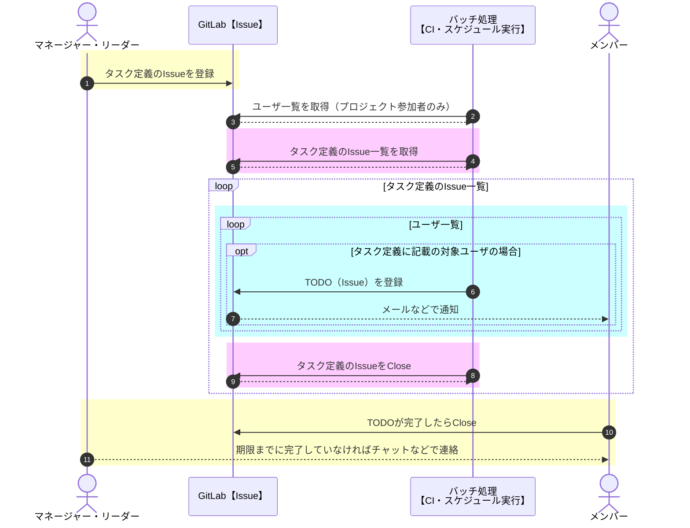
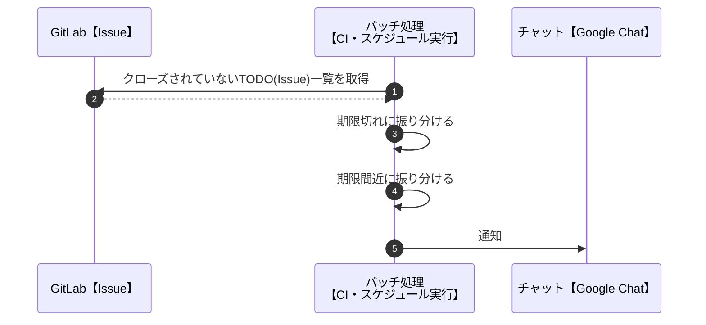

## はじめに

皆さんは、TODO管理を"Google Keep"などのツールで実施されているのではないでしょうか。
また、実施すべきタスク（月次処理など）をチームメンバー全員に登録するのは大変です。

今回は普段使っているGitLabを使ったチームや部署のTODO管理を実施する方法を記事にしました。
ポイントとしては、以下の2つになります。

- 「定義用のIssue」を1つ立てることでメンバー全員にTODOを登録するところを自動化
- 毎朝、リマインダーをチャット（Google Chat）に投稿する

## 下準備

### Issueのテンプレートを用意する

「タスク定義用」のissueテンプレートは以下になります。
このIssueに定義されている設定値を参照してTODO(Issue)を登録していきます。

````markdown: .gitlab\issue_templates\task.md
```yaml
start_date: "2024-02-03" # 開始日:YYYY-MM-DD
end_date: "2024-02-05" # 終了日:YYYY-MM-DD
title: "TEST" # タイトル
draft: False # falseの場合：TODO登録処理実行
users:
  - @hijiri.umemoto
  # ロールを指定することもできます(そのロール全員を登録)
```
xxxxxxxxxxxxxxxxxxxxxxxxxxxxxx  
xxxxxxxxxxxxxxxxxxxxxxxxxxxxxx  
xxxxxxxxxxxxxxxxxxxxxxxxxxxxxx  
xxxxxxxxxxxxxxxxxxxxxxxxxxxxxx
````

### ラベルを登録する

`Define`と`TODO`の2つ作成すること。

- `Define`
  - TODO定義用のラベル
- `TODO`
  - メンバーのTODOを表すラベル

|関連ラベル|
|:-:|
||

### トークンを発行する

GitLabでトークンを発行します。
※ 発行したトークンは必ずメモしておくこと。

|トークンの発行|
|:-:|
||

### スケジュール登録

パイプラインのスケジュールとして、定期的な処理をする設定をします。
Cronの構文で実行間隔を指定できます（SaaS版では1時間おきが一番短い間隔）。

|タスク登録用|
|:-:|
||

|リマインダー用|
|:-:|
||

## 処理フロー

### 処理フロー_TODO登録

登録したい内容を「定義用issue」で登録・管理し、「定義用issue」を基にTODO(issue)で登録します。
TODO(issue)登録に関してはGitLab-CIを活用して自動化します。

フローをシーケンス図にすると以下になります。

- イエローブロック：手動
- ピンクブロック：タスク定義Issue関連
- ブルーブロック：TODO(Issue)関連



### 処理フロー_リマインダー

GitLabの機能でも期限が近いと連絡（メール）が来ますが、見逃したり・放置する人がたまにいます。
そのため、メンバー全員が参加しているチャット(Google)に毎朝期限の迫ったissueを通知することにしました。



## 使ってみよう

【リーダーやマネージャー】テンプレートを用いて以下のようタスク定義用Issueを作ります。

|「タスク定義用」Issueのサンプル|
|:-:|
||

⇒ スケジュール実行(CI)を待ちます（手動実行も可能）。
⇒ TODO(Issue)が登録されます。

|スケジュール実行で登録されたTODO(Issue)のサンプル|
|:-:|
||

⇒ 【メンバー】TODO(Issue)の作業を実施する。
⇒ 【メンバー】TODO(Issue)のCloseする。

## おわりに

今回はGitLabを使ったチームや部署のTODOを一括登録できる仕組みを提案しました。
メンバーそれぞれにTODOを登録する必要をなくすことでTODOの登録処理が軽減できるはずです。

ソースコードは以下で公開しております。

https://gitlab.com/hijiri.umemoto/todolist
