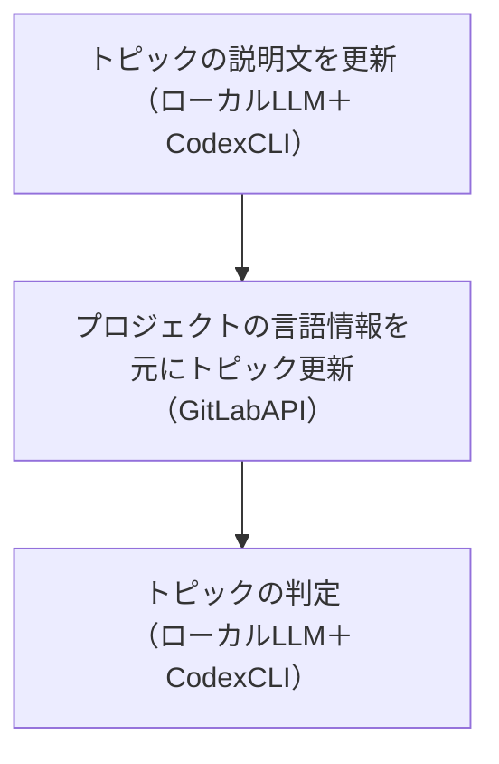
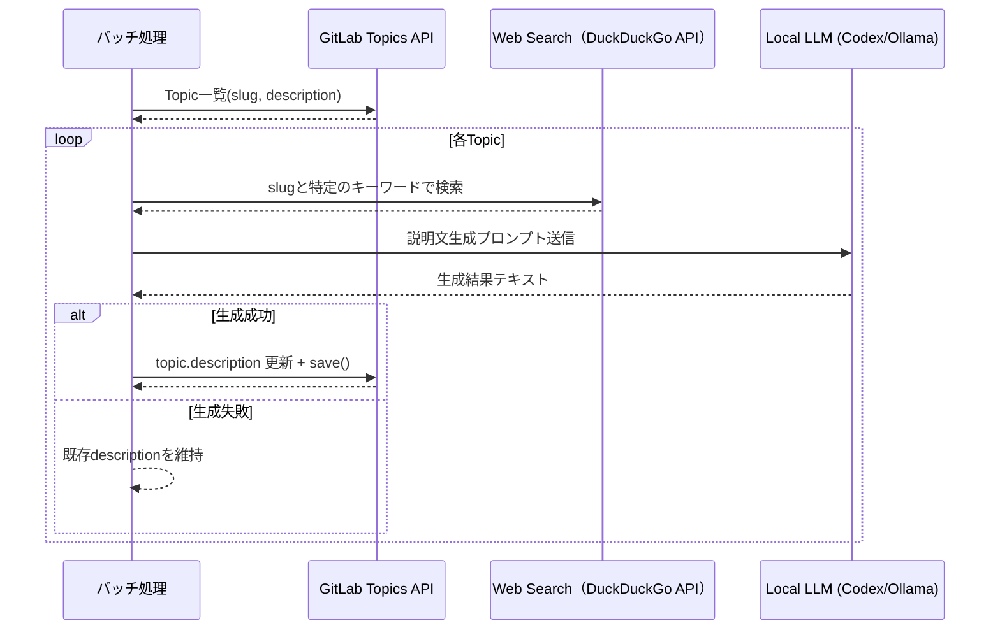
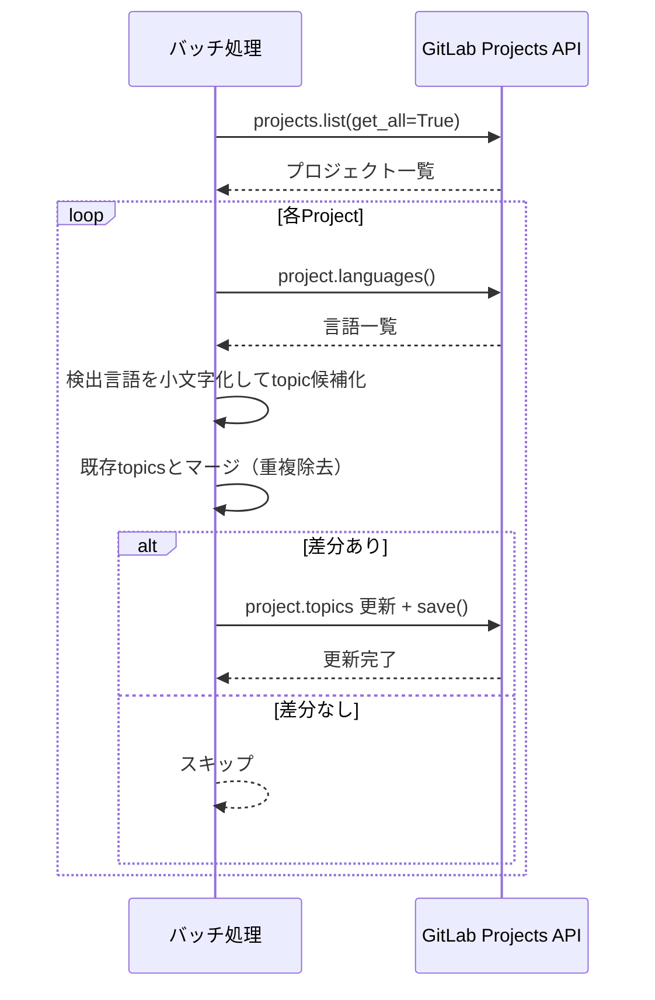
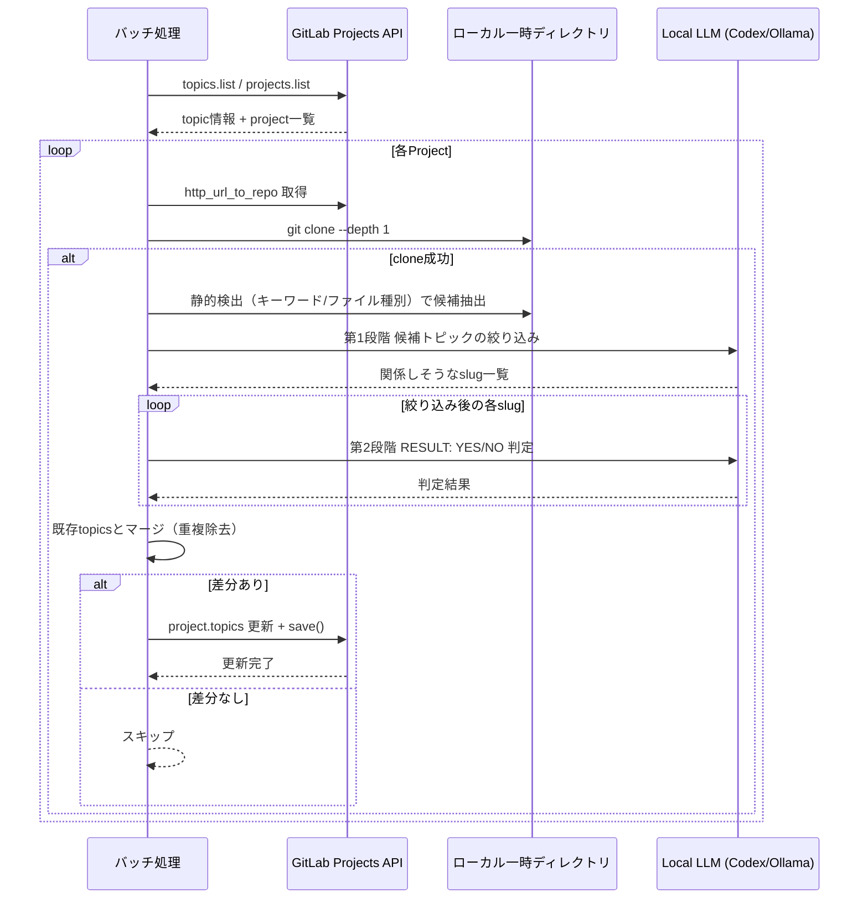

## はじめに

GitLabのトピックは検索性を上げるうえで有効ですが、手動メンテナンスは継続しづらいです。
本記事では、以下の3つの機能をベースにした自動設定フローを整理します。

- バッチ処理の実行条件・スケジューリング
- プロジェクトごとのトピック判定・更新
- トピック説明文の自動生成・補完

### 想定している読者

- GitLabをオンプレなどで運用しているエンジニア
- ローカルLLMの活用方法案を検討しているエンジニア

## 全体像



この順番で実行する理由は次のとおりです。

1. 先にトピック説明文を整備しておくと、後段のLLM判定時に「topicの意味」を渡せるため、精度が安定する
2. 次に言語ベースで機械的に付与できるトピックを埋めることで、最低限の網羅性を早く確保できる
3. 最後に時間のかかるリポジトリ解析を回し、言語名だけでは拾えないフレームワーク系トピックを補完する

まずは `--dry-run` で差分ログだけ確認し、意図どおりの更新になることを確認してから本更新する運用がおすすめです。

## トピック説明文作成（ローカルLLM＋CodexCLI）

GitLabトピック一覧を取得し、説明文が不足しているものを日本語で補完します。

### シーケンス-1



### CodexCLIへの指示文-1

```python
# トピック説明文生成用プロンプト
LLM_TOPIC_DESCRIPTION_PROMPT = """
以下のトピック（技術・フレームワーク・ツール）について、
**日本語**で説明文を生成してください。

## トピック情報
- 識別子（slug）: {slug}
- 既存の説明文: {existing_description}

## WEB検索結果（参考情報）
{web_search_context}

## 要件
1. 上記のWEB検索結果を参考にして、正確な説明文を生成してください
2. **必ず日本語で出力**してください（英語での出力は不可）
3. **400文字程度**（380〜420文字が理想）で簡潔にまとめてください
4. 技術者ではない人でも理解できるよう、わかりやすく説明してください
5. 主な用途や特徴を含めてください
6. 説明文のみを出力してください（前置きや補足説明は不要）
7. プロジェクトで使われているトピックかの判定基準を記載してください
8. 引用符（「」『』""）で囲まないでください
"""
```

## プロジェクトの言語情報を元にトピック更新（GitLabAPI）

GitLabトピック一覧を取得し、プロジェクトごとにGitLabから取得できると言語情報をトピックとして反映します。

### シーケンス-2



## トピックの判定（ローカルLLM＋CodexCLI）

リポジトリクローンした上で、CodexCLIを活用してLLMでトピックと一致するか解析します。

### シーケンス-3



### CodexCLIへの指示文

```python
# 第1段階: 候補トピックの絞り込み
LLM_TOPIC_FILTER_PROMPT = """
以下のトピック候補リストから、このプロジェクトに関係しそうなトピックを選択してください。

## 判定基準
- プロジェクトで使用されている可能性があるトピックを選択
- 明らかに関係のないトピックは除外
- 疑わしい場合は含める（後の詳細分析で判定）

## トピック候補
{topics}

## 回答形式
関係しそうなトピック名を1行1つで列挙してください。
関係するトピックがない場合は「NONE」と回答してください。
"""

# 第2段階: 実際に使用されているかの判定
LLM_TOPIC_ANALYSIS_PROMPT = """
以下のリポジトリ内を分析し、指定されたトピック（技術・フレームワーク）が
このプロジェクトで**実際に使用されているか**を判定してください。

## 判定基準
- 単なる言及や比較ではなく、実際にそのトピックが使用・依存されている場合のみ「YES」
- READMEでの説明、コメント内の言及、将来の予定などは「NO」
- 依存関係として明確に定義されている場合は「YES」

## トピック
名前: {topic}
説明: {description}
## 回答形式
以下の形式で回答してください（他の説明は不要）:
RESULT: YES または RESULT: NO
"""
```

## 必要な情報

### 必須

| 変数名 | 説明 |
| --- | --- |
| `GITLAB_URL` | GitLabのURL |
| `GITLAB_TOKEN` | GitLabアクセス用トークン |

### 推奨権限

- `GITLAB_TOKEN` は `api` スコープを持つPersonal Access Tokenを推奨
- Projectの更新が必要なため、対象プロジェクトに対してMaintainer相当以上の権限が必要
- Topicの更新には管理者の権限が必要
- 運用時は専用トークンを作成し、用途をこのバッチに限定する

### 実行環境の前提

- Python 3.10以上
- `python-gitlab` がインストール済み
- `codex` コマンドが利用可能（Ollama連携を使う場合はローカルで起動済み）
- ネットワーク経由でGitLab API / DuckDuckGo APIにアクセスできる
- LLM解析を有効化する場合は `git clone` 可能な認証設定（HTTPSトークンやSSH鍵）を準備する

### .codex/config.toml

Codex CLIの設定ファイルです。Ollamaサーバーへの接続情報とモデル設定を定義します。

```toml
profile = "gpt-oss-20b"

[model_providers.Ollama]
name = "Ollama"
base_url = "http://localhost:11434/v1"
wire_api = "responses"

[profiles.gpt-oss-20b]
model = "gpt-oss:20b"
model_provider = "Ollama"
```

## サンプルコード

```python
#!/usr/bin/env python3
"""GitLabトピック自動設定の最小サンプル。
以下の3機能を実装する:
1. トピック説明文の補完（DuckDuckGo + ローカルLLM）
2. プロジェクト言語情報からトピック更新
3. リポジトリ解析 + 2段階LLM判定でトピック更新（任意）
"""

from __future__ import annotations

import argparse
import json
import logging
import os
import re
import shutil
import subprocess
import tempfile
from pathlib import Path
from typing import Iterable, TypedDict
from urllib.parse import urlencode
from urllib.request import Request, urlopen

import gitlab

LOG = logging.getLogger(__name__)

# 「日本語として最低限読める説明か」を判定するための簡易正規表現。
JAPANESE_CHAR_PATTERN = re.compile(r"[\u3040-\u309F\u30A0-\u30FF\u4E00-\u9FFF]")

LLM_TOPIC_DESCRIPTION_PROMPT = """
以下のトピック（技術・フレームワーク・ツール）について、
**日本語**で説明文を生成してください。

## トピック情報
- 識別子（slug）: {slug}
- 既存の説明文: {existing_description}

## WEB検索結果（参考情報）
{web_search_context}

## 要件
1. 上記のWEB検索結果を参考にして、正確な説明文を生成してください
2. **必ず日本語で出力**してください（英語での出力は不可）
3. **400文字程度**（380〜420文字が理想）で簡潔にまとめてください
4. 技術者ではない人でも理解できるよう、わかりやすく説明してください
5. 主な用途や特徴を含めてください
6. 説明文のみを出力してください（前置きや補足説明は不要）
7. プロジェクトで使われているトピックかの判定基準を記載してください
8. 引用符（「」『』""）で囲まないでください
"""

LLM_TOPIC_FILTER_PROMPT = """
以下のトピック候補リストから、このプロジェクトに関係しそうなトピックを選択してください。

## 判定基準
- プロジェクトで使用されている可能性があるトピックを選択
- 明らかに関係のないトピックは除外
- 疑わしい場合は含める（後の詳細分析で判定）

## トピック候補
{topics}

## 回答形式
関係しそうなトピック名を1行1つで列挙してください。
関係するトピックがない場合は「NONE」と回答してください。
"""

LLM_TOPIC_ANALYSIS_PROMPT = """
以下のリポジトリ内を分析し、指定されたトピック（技術・フレームワーク）が
このプロジェクトで**実際に使用されているか**を判定してください。

## 判定基準
- 単なる言及や比較ではなく、実際にそのトピックが使用・依存されている場合のみ「YES」
- READMEでの説明、コメント内の言及、将来の予定などは「NO」
- 依存関係として明確に定義されている場合は「YES」

## トピック
名前: {topic}
説明: {description}
## 回答形式
以下の形式で回答してください（他の説明は不要）:
RESULT: YES または RESULT: NO
"""


CODEX_TIMEOUT = int(os.getenv("CODEX_TIMEOUT", "3600"))


class CodexAnalysisResult(TypedDict):
    success: bool
    output: str
    error: str | None


def analyze_content_with_codex(
    content: str,
    prompt: str,
    *,
    timeout: int | None = None,
) -> CodexAnalysisResult:
    """Codex CLIでテキスト内容を分析する。"""
    if timeout is None:
        timeout = CODEX_TIMEOUT

    # prompt と context を1つの入力にまとめて Codex CLI に渡す。
    full_prompt = f"{prompt}\n\n---\n{content}"
    # `codex exec` を直接叩き、標準出力をそのまま判定結果として扱う。
    cmd = [
        "codex",
        "exec",
        "--skip-git-repo-check",
        "-s",
        "workspace-write",
        full_prompt,
    ]

    try:
        result = subprocess.run(
            cmd,
            capture_output=True,
            text=True,
            timeout=timeout,
            check=False,
        )
        if result.returncode == 0:
            # 正常時は stdout のみ返し、呼び出し側で用途別に解釈する。
            return CodexAnalysisResult(
                success=True,
                output=result.stdout.strip(),
                error=None,
            )
        error_msg = result.stderr.strip() or "Unknown error"
        return CodexAnalysisResult(
            success=False,
            output=result.stdout.strip(),
            error=error_msg,
        )
    except subprocess.TimeoutExpired:
        return CodexAnalysisResult(
            success=False,
            output="",
            error=f"Timeout after {timeout} seconds",
        )
    except FileNotFoundError:
        return CodexAnalysisResult(
            success=False,
            output="",
            error="Codex CLI not found. Please install @openai/codex.",
        )
    except OSError as exc:
        return CodexAnalysisResult(
            success=False,
            output="",
            error=f"OS error: {str(exc)}",
        )


def call_codex(prompt: str, context: str = "") -> str:
    """Codex CLI経由でプロンプトを実行する。"""
    result = analyze_content_with_codex(content=context, prompt=prompt)
    if not result["success"]:
        error = result["error"] or "codex execution failed"
        raise RuntimeError(error)
    return result["output"].strip()


def duckduckgo_summary(query: str) -> str:
    """DuckDuckGo Instant Answerから簡易要約テキストを作る。"""
    # 検索語を少し補強して、技術トピックとしてヒットしやすくする。
    params = urlencode(
        {
            "q": f"{query} programming framework tool",
            "format": "json",
            "no_html": "1",
            "skip_disambig": "1",
        }
    )
    url = f"https://api.duckduckgo.com/?{params}"
    req = Request(url, headers={"User-Agent": "topic-autoset-sample/1.0"})
    try:
        with urlopen(req, timeout=30) as resp:
            data = json.loads(resp.read().decode("utf-8"))
    except Exception as exc:
        LOG.warning("DuckDuckGo検索失敗 query=%s err=%s", query, exc)
        return ""

    lines = []
    # Instant Answerの要約本文（あれば最優先で採用）
    abstract = (data.get("AbstractText") or "").strip()
    if abstract:
        lines.append(abstract)
    # 関連トピックはノイズが入りやすいので先頭5件に絞る。
    for topic in data.get("RelatedTopics", [])[:5]:
        if isinstance(topic, dict):
            text = (topic.get("Text") or "").strip()
            if text:
                lines.append(text)
    return "\n".join(lines)


def has_sufficient_japanese_description(text: str) -> bool:
    return len(text.strip()) >= 20 and bool(JAPANESE_CHAR_PATTERN.search(text))


def safe_project_name(project: object, fallback: str) -> str:
    """python-gitlabオブジェクトの状態に依存せず表示名を取得する。"""
    attrs = getattr(project, "__dict__", {}).get("_attrs")
    if isinstance(attrs, dict):
        value = attrs.get("path_with_namespace")
        if value:
            return str(value)
    return fallback


def update_topic_descriptions(gl: gitlab.Gitlab, dry_run: bool) -> None:
    LOG.info("topic description update start")
    for topic in gl.topics.list(get_all=True):
        slug = (getattr(topic, "name", None) or getattr(topic, "slug", "")).strip()
        if not slug:
            continue
        description = (getattr(topic, "description", "") or "").strip()
        # 既に日本語説明が十分なら再生成しない（コスト削減）。
        if has_sufficient_japanese_description(description):
            continue

        web_context = duckduckgo_summary(slug)
        prompt = LLM_TOPIC_DESCRIPTION_PROMPT.format(
            slug=slug,
            existing_description=description or "(なし)",
            web_search_context=web_context or "(検索結果なし)",
        )
        try:
            generated = call_codex(prompt)
        except Exception as exc:
            LOG.warning("description generation failed slug=%s err=%s", slug, exc)
            continue

        if not generated:
            continue
        if dry_run:
            # dry-run時は更新せず「何を更新するか」だけ出す。
            LOG.info("[DRY-RUN] topic.description update slug=%s", slug)
            continue
        topic.description = generated
        topic.save()
        LOG.info("topic.description updated slug=%s", slug)


def update_topics_from_languages(gl: gitlab.Gitlab, dry_run: bool) -> None:
    LOG.info("project topic update by languages start")
    projects = gl.projects.list(get_all=True)
    for p in projects:
        # 一覧APIの戻り値は軽量なので、詳細情報を取り直してから処理する。
        project = gl.projects.get(p.id)
        project_name = safe_project_name(
            project, getattr(p, "path_with_namespace", f"id={p.id}")
        )
        langs = project.languages() or {}
        # GitLabの言語名（Python など）を topic 用に小文字へ統一。
        new_topics = {lang.lower() for lang in langs.keys()}
        if not new_topics:
            continue
        merged = sorted(set(project.topics or []) | new_topics)
        # 既存と同じなら API 更新しない。
        if merged == sorted(project.topics or []):
            continue
        if dry_run:
            LOG.info(
                "[DRY-RUN] project topics update project=%s topics=%s",
                project_name,
                merged,
            )
            continue
        project.topics = merged
        project.save()
        LOG.info("project topics updated project=%s", project_name)


def collect_repo_context(repo_dir: Path, max_chars: int = 12000) -> str:
    """判定に必要な主要ファイルのみ抜粋する。"""
    # 依存関係・技術スタック判断に効きやすいファイルに限定する。
    targets = [
        "README.md",
        "package.json",
        "requirements.txt",
        "pyproject.toml",
        "go.mod",
        "Cargo.toml",
        "pom.xml",
        "Gemfile",
        "composer.json",
        "Dockerfile",
    ]
    chunks: list[str] = []
    for rel in targets:
        path = repo_dir / rel
        if not path.exists() or not path.is_file():
            continue
        try:
            text = path.read_text(encoding="utf-8", errors="ignore")
        except Exception:
            continue
        chunks.append(f"### {rel}\n{text[:2000]}")
    joined = "\n\n".join(chunks)
    # LLM入力が大きすぎないように最終的に上限で切る。
    return joined[:max_chars]


def extract_candidate_topics(topic_slugs: Iterable[str], context: str) -> list[str]:
    lower = context.lower()
    return sorted([slug for slug in topic_slugs if slug in lower])


def run_llm_topic_analysis(
    gl: gitlab.Gitlab, dry_run: bool, max_projects: int | None = None
) -> None:
    LOG.info("project topic update by LLM analysis start")
    # slug -> description の辞書を作って判定時に参照する。
    topic_objs = gl.topics.list(get_all=True)
    topic_descriptions = {
        (getattr(t, "name", None) or getattr(t, "slug", "")).strip().lower(): (
            (getattr(t, "description", "") or "").strip()
        )
        for t in topic_objs
    }
    topic_slugs = [slug for slug in topic_descriptions.keys() if slug]

    projects = gl.projects.list(get_all=True)
    if max_projects is not None:
        # バッチ時間を制御するため、必要なら対象件数を制限。
        projects = projects[:max_projects]

    for p in projects:
        project = gl.projects.get(p.id)
        project_name = safe_project_name(
            project, getattr(p, "path_with_namespace", f"id={p.id}")
        )
        repo_url = project.http_url_to_repo
        # プロジェクト単位で一時ディレクトリを作り、処理後に必ず削除する。
        work_dir = Path(tempfile.mkdtemp(prefix="topic-autoset-"))
        try:
            # 解析だけが目的なので shallow clone で高速化。
            subprocess.run(
                ["git", "clone", "--depth", "1", repo_url, str(work_dir / "repo")],
                check=True,
                capture_output=True,
                text=True,
            )
            repo_dir = work_dir / "repo"
            context = collect_repo_context(repo_dir)
            if not context:
                continue

            # 第0段階: 文字列一致ベースで候補を絞り、LLM呼び出し回数を減らす。
            static_candidates = extract_candidate_topics(topic_slugs, context)
            if not static_candidates:
                continue

            # 第1段階: 候補から「関係ありそう」なものだけ選ばせる。
            filter_prompt = LLM_TOPIC_FILTER_PROMPT.format(
                topics="\n".join(static_candidates)
            )
            filtered_raw = call_codex(filter_prompt, context)
            filtered = [
                line.strip().lower()
                for line in filtered_raw.splitlines()
                if line.strip() and line.strip().upper() != "NONE"
            ]

            decided_yes: set[str] = set()
            for slug in filtered:
                if slug not in topic_descriptions:
                    continue
                # 第2段階: トピックごとに YES/NO を厳密判定する。
                judge_prompt = LLM_TOPIC_ANALYSIS_PROMPT.format(
                    topic=slug,
                    description=topic_descriptions[slug] or "(説明なし)",
                )
                result = call_codex(judge_prompt, context)
                if "RESULT: YES" in result.upper():
                    decided_yes.add(slug)

            merged = sorted(set(project.topics or []) | decided_yes)
            if merged == sorted(project.topics or []):
                continue
            if dry_run:
                LOG.info(
                    "[DRY-RUN] llm topics update project=%s topics=%s",
                    project_name,
                    merged,
                )
                continue
            project.topics = merged
            project.save()
            LOG.info("llm topics updated project=%s", project_name)
        except subprocess.CalledProcessError as exc:
            # clone失敗は他プロジェクトに影響させず、警告ログのみで継続。
            LOG.warning(
                "clone failed project=%s stderr=%s",
                project_name,
                exc.stderr.strip(),
            )
        except Exception as exc:
            LOG.warning("llm analysis failed project=%s err=%s", p.id, exc)
        finally:
            shutil.rmtree(work_dir, ignore_errors=True)


def build_gitlab_client() -> gitlab.Gitlab:
    url = os.getenv("GITLAB_URL")
    token = os.getenv("GITLAB_TOKEN")
    if not url or not token:
        raise ValueError("GITLAB_URL / GITLAB_TOKEN を設定してください")
    gl = gitlab.Gitlab(url, private_token=token)
    gl.auth()
    return gl


def parse_args() -> argparse.Namespace:
    parser = argparse.ArgumentParser(description="GitLab topic autoset sample")
    parser.add_argument("--dry-run", action="store_true", help="更新はせずログのみ")
    parser.add_argument(
        "--with-llm-analysis",
        action="store_true",
        help="リポジトリ解析 + 2段階LLM判定を実行",
    )
    parser.add_argument(
        "--llm-project-limit",
        type=int,
        default=20,
        help="LLM解析の対象プロジェクト上限",
    )
    return parser.parse_args()


def main() -> None:
    logging.basicConfig(
        level=logging.INFO, format="%(asctime)s %(levelname)s %(message)s"
    )
    args = parse_args()
    # 認証に失敗した時点で例外にして終了する。
    gl = build_gitlab_client()

    # 1) topic説明文補完 を常に実行。
    update_topic_descriptions(gl, dry_run=args.dry_run)
    #  2) 言語由来topic更新 を常に実行。
    update_topics_from_languages(gl, dry_run=args.dry_run)
    # 3) LLM解析は時間がかかるため明示フラグでのみ実行。
    if args.with_llm_analysis:
        run_llm_topic_analysis(
            gl, dry_run=args.dry_run, max_projects=args.llm_project_limit
        )


if __name__ == "__main__":
    main()
```

### 実行手順

#### 1. 環境変数を設定

```bash
export GITLAB_URL="https://gitlab.example.com"
export GITLAB_TOKEN="xxxxxxxx"
```

#### 2. まず dry-run で確認

```bash
python gitlab_topic_autoset.py --dry-run
```

`[DRY-RUN]` ログに更新予定のトピックが出るため、意図しない大量更新がないか確認します。

#### 3. 問題なければ本更新

```bash
python gitlab_topic_autoset.py
```

#### 4. 必要時のみ LLM 解析を追加

```bash
python gitlab_topic_autoset.py --with-llm-analysis --llm-project-limit 20
```

LLM解析はcloneと複数回推論するため、まずは少ない件数で試し、実行時間を見ながら上限値を調整します。

## 運用のコツ

### 誤判定を減らすポイント

- 第1段階（候補絞り込み）は「過検出を許容」し、第2段階でYES/NOを厳密に判定する
- Topic説明文は「何を根拠に使用中とみなすか」を含めると判定が安定しやすい
- 言語由来トピックとLLM由来トピックを同時に消し込まない（本サンプルは追加のみ）ことで、安全側に倒せる

### スケジューリング例

- 毎日: 言語由来トピック更新（軽量）
- 週次: トピック説明文補完（必要時のみ）
- 週次または隔週: LLM解析（上限件数を決めて段階実行）

### 失敗時の扱い

- 個別プロジェクトのclone失敗は警告ログのみで継続する設計
- LLM応答失敗時は既存値を保持し、無理に更新しない
- 例外時に全体停止しないよう、プロジェクト単位でエラーを吸収する

## おわりに

ここまでの構成で、トピック運用の自動化とローカルLLM活用の最小セットは実装できます。
実運用では、判定精度と処理時間のバランスを見ながら段階的に改善するのがおすすめです。
