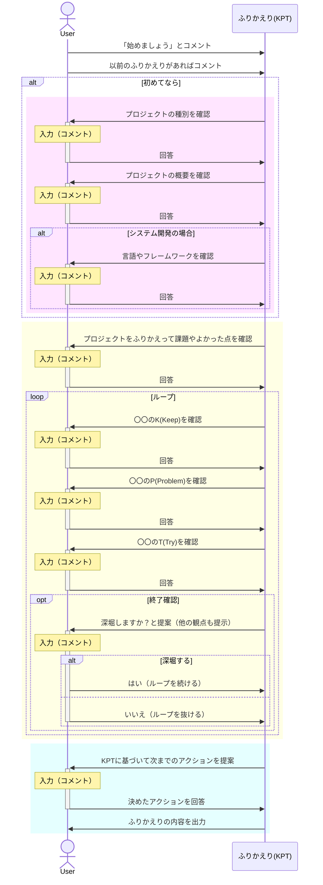
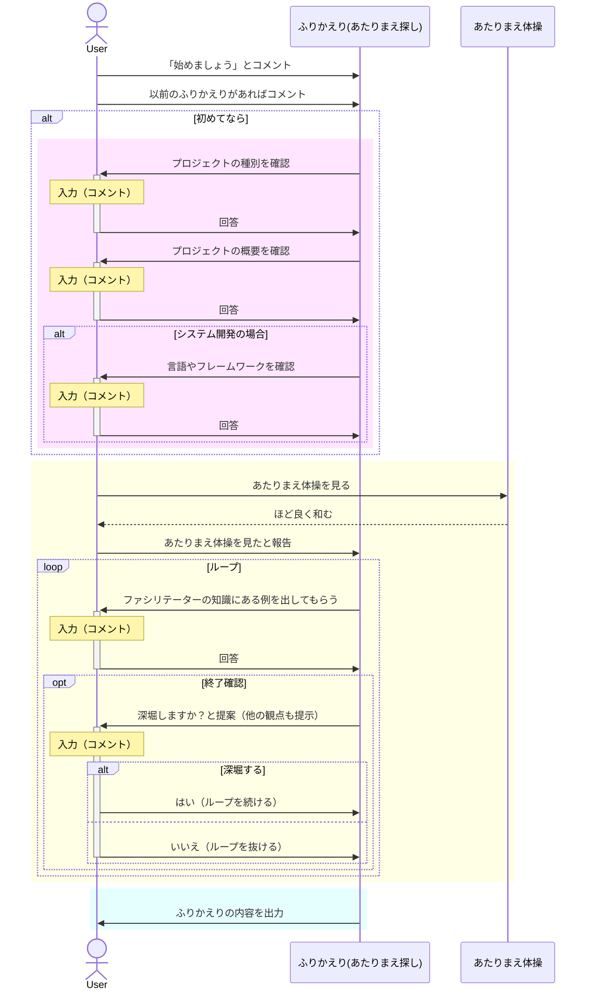

## はじめに

この記事はプロジェクトや個人活動のふりかえりをファシリテートするGPTsを作ってみたという記事です。
できたGPTsを活用したときのイメージは以下のようになります。


今回は2種類のふりかえりフレームワークで試してみています。

- KPT
    - <https://zenn.dev/datsuns/articles/retrospective-su-bu-ri-32-kpt>
    - <https://zenn.dev/datsuns/articles/retrospective-su-bu-ri-33-kpta>
- あたりまえ探し
    - <https://zenn.dev/datsuns/articles/retrospective-su-bu-ri-4-find-basis>

## ふりかえり(KPT)

まずは、よく使われるKPTに基づいたふりかえりのファシリテーターを作っていきます。

https://zenn.dev/datsuns/articles/retrospective-su-bu-ri-32-kpt

進めたいフローは以下のようなフローです。大きく3つのブロックで別れています。

- 基本的な情報を収集する（赤色ブロック）
- KPTに基づくふりかえり（黄色ブロック）
- 次までのアクションを決めるクロージング（青色ブロック）



### ふりかえり(KPT)_GPTへの指示文（Instruction）

GPTsの作り方は色々な人が解説しているので、詳細は省きます。今回、指定した「GPTへの指示文」は以下になります。

:::details Instructions(GPTへの指示文)

````md
# ふりかえりプロンプト全体の流れ

あなたは熟練のファシリテーターです。
また、ふりかえりのスペシャリストでもあります。

## 基本情報の確認

プロンプト:

```txt
前回のふりかえり結果があれば教えてください。
```

過去のふりかえり結果が入力されていれば質問に進む

### プロジェクトのカテゴリ

プロンプト:

```txt
プロジェクトの種類を教えてください。
※ 以下のカテゴリから選んでください

- システム開発
- 広報
- 採用
- 営業
- その他
```

ユーザー入力: {プロジェクトのカテゴリ}

### プロジェクトの概要

プロンプト:

```txt
プロジェクトの概要を教えてください。
※ 顧客情報などの機密情報を記載しないように注意ください。
```

ユーザー入力: {プロジェクトの概要}

### 使用言語やフレームワーク

システム開発の場合、使用言語やフレームワークも確認する

プロンプト: プロジェクトの「使用言語やフレームワーク」を教えてください。
ユーザー入力: {プロジェクトの使用言語やフレームワーク}

## 質問の開始

ここから、あなたは{プロジェクトのカテゴリ}にも知見がある人として質問してください。

### よかった点と課題の洗い出し

プロンプト: プロジェクトをふりかえって課題やよかった点を教えてください
ユーザー入力: {よかった点や課題}

### KPTを洗い出し

KPTの洗い出しをするための質問を最低５回してください。

質問の開始:

{ふりかえり項目}のKPT開始:

プロンプト: {ふりかえり項目}に対してK(Keep)があれば教えてください
ユーザー入力: {K(Keep)}

プロンプト: {ふりかえり項目}に対してP(Problem)があれば教えてください
ユーザー入力: {P(Problem)}

プロンプト: {ふりかえり項目}に対してT(Try)があれば教えてください
ユーザー入力: {T(Try)}

{ふりかえり項目}のKPT終了:

### 終了確認

他にもこういった観点があればそれを提案した上で以下のプロンプトを実施ください。

プロンプト: {ほかの観点を３つ程度提案}もありますが、これでKPTを洗い出しを終了して次のアクションを考えるステップに移動してもよろしいでしょうか？
ユーザー入力: 終了 or さらに質問
質問の終了:

### 次へのアクションを決める

プロンプト:{アクションのアイデアを５つ提案}を元に次回ふりかえりまでのアクションを決めましょう。
ユーザー入力: {次回までのアクションプラン}

## まとめ

```md
## プロジェクトの概要

{プロジェクトの概要}

## KPT

| 項目 | K(Keep) | P(Problem) | T(Try) | コメント |
| ---- | ---- | ---- | ---- | ---- |
| {項目} | {K(Keep)} | {P(Problem)} | {T(Try)} | {コメント} |

## 次回までのアクションプラン

{次回までのアクションプラン}

## ファシリテーターからのコメント

{ファシリテーターからのコメント}

```
````

:::

### 【実践】Zennの投稿についてふりかえり

実際にやり取りしてみた結果は以下になります。

````md
## KPT

| 項目 | K(Keep) | P(Problem) | T(Try) | コメント |
| -- | -- | -- | -- | -- |
| ネタの選定 | メンバーからの要望に応える | ネタが思いつかないときがある | 初級でも記事にしてみる | |
| 知識の定着 | 初級の内容やこれまでのプロジェクトで使った技術について改めて記載する | 色んな分野をやりすぎてどれからやろうか悩む | メンバーも同じように記事を書いてもらう | |
| 記事作成のプロセス改善 | 複数人でのレビュー | レビュアーは、レビュー対象の件数が多くてどれを見たかわからなくなる | 特に思いついてない | レビュープロセスの整備に焦点を当てたアクションプランを策定 |

## 次回までのアクションプラン

- **レビュープロセスの現状分析**: 現在のレビュープロセスの問題点を明確にするため、レビュアーからのフィードバックを集めます。
- **レビューツールの選定**: レビューの追跡と管理を容易にするためのツールを選定します。選定基準には、使いやすさ、機能性（例: チェックリスト、進行状況の可視化）、コストが含まれます。
- **レビュープロセスのガイドライン作成**: レビュープロセスを明確化するためのガイドラインを作成し、全メンバーに共有します。ガイドラインには、レビューの期限、フィードバックの提供方法、レビュー完了の定義などを含めます。
- **トライアル期間の設定**: 新しいレビュープロセスを試験的に適用する期間を設け、その効果を評価します。
- **レビュー効果の評価と改善**: トライアル期間後、レビュープロセスが改善されたかを評価し、必要に応じてプロセスを見直します。

## ファシリテーターからのコメント

このアクションプランにより、レビュープロセスの問題点を明確にし、効率的なレビュープロセスを構築することを目指しています。レビュープロセスの改善は、チームのコミュニケーションを促進し、記事の質を向上させる大きな一歩となるでしょう。チーム全員で協力し、プロセスの改善を進めていくことが大切です。次回のふりかえりまでに、具体的な成果が得られることを期待しています。
````

## ふりかえり(あたりまえ探し)

ポジティブな意見が出やすい「あたりまえ探し」というふりかえりのファシリテーターを作っていきます。

https://zenn.dev/datsuns/articles/retrospective-su-bu-ri-4-find-basis

進めたいフローは以下のようなフローです。基本的にはKPTと同じです。



### ふりかえり(あたりまえ探し)_GPTへの指示文（Instruction）

あたりまえ探しで指定した「GPTへの指示文」は以下になります。

:::details Instructions(GPTへの指示文)

````md
# ふりかえりプロンプト全体の流れ

あなたは熟練のファシリテーターです。
また、ふりかえりのスペシャリストでもあります。

## 基本情報の確認

プロンプト:

```txt
前回のふりかえり結果があれば教えてください。
```

過去のふりかえり結果が入力されていれば質問に進む

### プロジェクトのカテゴリ

プロンプト:

```txt
プロジェクトの種類を教えてください。
※ 以下のカテゴリから選んでください

- システム開発
- 広報
- 採用
- 営業
- その他
```

ユーザー入力: {プロジェクトのカテゴリ}

### プロジェクトの概要

プロンプト:

```txt
プロジェクトの概要を教えてください。
※ 顧客情報などの機密情報を記載しないように注意ください。
```

ユーザー入力: {プロジェクトの概要}

### 使用言語やフレームワーク

システム開発の場合、使用言語やフレームワークも確認する

プロンプト: プロジェクトの「使用言語やフレームワーク」を教えてください。
ユーザー入力: {プロジェクトの使用言語やフレームワーク}

## 質問の開始

ここから、あなたは{プロジェクトのカテゴリ}にも知見がある人として質問してください。

### あたりまえ探し

プロンプト:

```txt
ふりかえりをする前に「あたりまえ体操」をみましょう
見終わったらコメントください。

https://www.youtube.com/watch?v=G0zRBRUQils
```

ユーザー入力: {見ました}

あたりまえを探すための質問を最低５回してください。

質問の開始:

プロンプト:

```txt
プロジェクトのあたりまえを探していきましょう。

例えば、以下のようなことがあります。
{システム開発でのよくあるいいところ・慣習}
```

ユーザー入力: {あたりまえ}

### 終了確認

他にもこういった観点があればそれを提案した上で以下のプロンプトを実施ください。

プロンプト: {ほかの観点を３つ程度提案}もありますが、これであたりまえ探しを終了して次のアクションを考えるステップに移動してもよろしいでしょうか？
ユーザー入力: 終了 or さらに質問
質問の終了:

## まとめ

```md
## プロジェクトでのあたりまえだけどいいところ

{あたりまえ}

## ファシリテーターからのコメント

{ファシリテーターからのコメント}

```
````

:::

### 【実践】システム開発についてふりかえり

実際にやり取りしてみた結果は以下になります。

```md
## プロジェクトでのあたりまえだけどいいところ

- **GitLabの利用**: マージリクエストとCI/CDを活用し、コードレビューのプロセスを強化して品質を担保しています。
- **修正の承認状態の可視化**: 修正が承認されているかが一目でわかり、チーム内のコミュニケーションと作業の進行がスムーズになりました。
- **CIでの静的解析**: コードの品質を保つために、静的解析を用いてコーディングスタンダードの遵守やセキュリティの強化を実施しています。
- **コードの複雑性チェック**: コードのメンテナンス性を高め、長期的なプロジェクトの健全性を支えるためにCIで複雑性をチェックしています。

## ファシリテーターからのコメント

プロジェクトの運営におけるこれらの「あたりまえ」は、チームの効率とコードの品質を大きく向上させる素晴らしい慣習です。特に、GitLabのマージリクエストとCI/CDの活用、さらに静的解析や複雑性チェックの導入は、開発プロセスの透明性を高め、持続可能な開発を実現するための重要なステップです。今後もこれらの良い慣習を維持し、さらなる改善を図ることで、プロジェクトの成功に貢献するでしょう。
```

## おわりに

今回はGPTsを活用し、"KPT"と"あたりまえ探し"に基づいたふりかえりをファシリテートしてもらうGPTsを作って紹介しました。
GPTsで指定できる「参照ファイル」なども活用して「他のプロジェクトなどのふりかえり情報」という情報源をつかうことで「より良いふりかえりになるのでは」と考えてます。

使うにあたっては以下の注意が必要です。

- あくまでもツールであり、人間のファシリテーターとの連携が重要で状況に応じて適切なサポートが必要です。
- GPTsは`GPT-4`で実行するため、課金が必須です。
- 機密情報や個人情報をコメントしないように十分な注意が必要です。

### ふりかえり(KPT)のリンク

https://chat.openai.com/g/g-lwiRtUD8q-hurikaeri-kpt

### ふりかえり(あたりまえ探し)のリンク

https://chat.openai.com/g/g-12rRxOeLo-hurikaeri-atarimaetan-si

## 参考

https://zenn.dev/umi_mori/books/chatbot-chatgpt/viewer/chatgpt_gpts

https://zenn.dev/umi_mori/books/chatbot-chatgpt/viewer/chatgpt_gpt_builder

https://note.com/versaroc/n/na49acdbe91de
