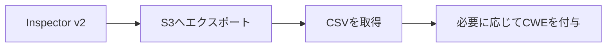
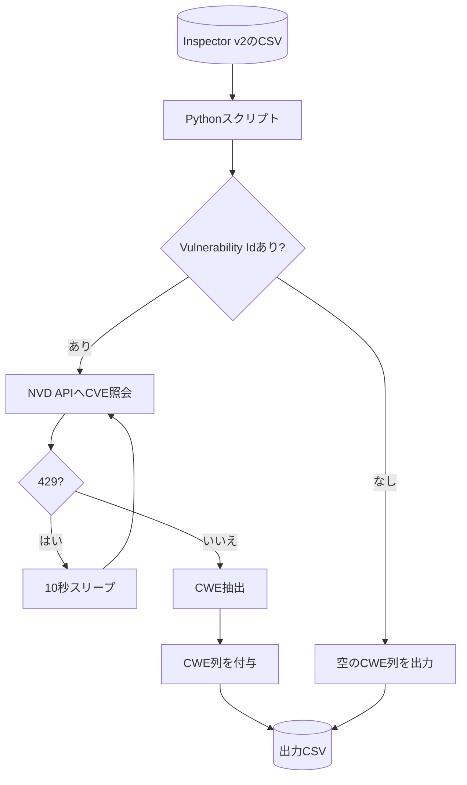

## はじめに

自分向けの備忘録として、Inspector v2のFindingsをS3へエクスポートし、CSVにCWEを付与して分析しやすくする流れをまとめています。
Inspectorで検出した脆弱性の情報を`S3にエクスポート(CSV)`するのと`CSVにCVEのIDを元に情報を検索してCWE付与`することがメインです。

## 対象読者

- Inspector v2の検出結果をCSVで外部分析したい人
- 複数アカウントの検出結果をS3に集約したい人
- まずは最低手順だけ把握したい人

## ざっくり流れ（S3エクスポート → CWE付与）



## 事前準備

- Inspector v2が有効化済み
- S3/KMSを作成・設定できる権限がある

## 手順（S3へエクスポート）

1. **S3バケットを用意**
   - Inspectorの検出があるリージョンと同じリージョンに作成
   - Inspectorからの書き込みを許可するバケットポリシーを付与
2. **KMSのカスタマー管理キー（対称）を用意**
   - S3出力にはKMSキー指定が必須
   - Inspectorが`kms:GenerateDataKey`などを利用できるキーポリシーを付与
3. **レポート作成（マネジメントコンソール or CLI）**
   - 形式はCSV/JSONを選べる
   - デフォルトは「Activeの全検出結果」
   - フィルタでステータスやリソース単位に絞り込み可能

詳細は以下の記事を参照してください。

https://dev.classmethod.jp/articles/inspector-v2-s3-export/

## CSVにCWE列を追加する（簡易なサンプル）

`Vulnerability Id`（CVE）からCWEを引いて、`CWE`列を追加する例です。
APIのステータスで`429`が出たら10秒待機して最大3回リトライします。

補足として、CVEは個別の脆弱性に付与される識別子で、CWEは脆弱性の種類（パターン）を分類するための体系です。
表記が似ているため混同しやすいですが、CVEで「何が起きたか」を引き当て、CWEで「どのような種類か」を整理するイメージです。

### フロー（CVE→CWE付与）



### ポイント

- **入力列**: `Vulnerability Id` をCVEとして扱う
- **出力列**: 既存列に `CWE` を追加（未存在時）
- **重複回避**: 同一CVEはキャッシュしてAPI呼び出しを削減
- **レート制限対策**: 429時は10秒待機して最大3回リトライ
- **出力形式**: CWEは`;`区切り（重複排除してソート）

### 使い方

```bash
python script.py input.csv output.csv
```

`input.csv` はInspector v2のエクスポートCSVを想定しています。

### 出力イメージ

```txt
Vulnerability Id,CWE
CVE-2021-44228,CWE-20;CWE-400
```

```python
import csv
import time
import requests


def get_cwe_from_cve(cve_id):
    """指定されたCVE IDからCWE情報を取得する関数"""
    # NVD APIのエンドポイント (最新版)
    print(cve_id)
    url = f"https://services.nvd.nist.gov/rest/json/cves/2.0/?"
    params = {
        "cveId": cve_id
    }

    try:
        # レート制限対策で最大3回までリトライ
        for _ in range(3):
            response = requests.get(url, params=params)
            if response.status_code == 429:
                # レート制限に当たった場合は待機
                time.sleep(10)
                continue
            response.raise_for_status()  # 2xx以外は例外（429は上でリトライ）
            break
        else:
            print(f"CVE ID {cve_id} の取得で429が続いたため中断します。")
            return None
        data = response.json()
        # NVD側の負荷を避けるために少し待機
        time.sleep(2)

        if data.get('totalResults', 0) > 0:
            cve_item = data['vulnerabilities'][0]['cve']

            cwe_info = []
            if 'weaknesses' in cve_item:
                for weakness in cve_item['weaknesses']:
                    # cwe_id = weakness['cweId']
                    description = weakness['description'][0]['value']
                    cwe_info.append(description)

            return cwe_info
        else:
            print(f"CVE ID {cve_id} は見つかりませんでした。")
            return None

    except requests.exceptions.RequestException as e:
        print(f"APIリクエスト中にエラーが発生しました: {e}")
        return None
    except (KeyError, IndexError, TypeError) as e:
        print(f"JSONデータのパース中にエラーが発生しました: {e}")
        return None


def cwe_ids_from_details(cwe_details):
    if not cwe_details:
        return ""
    # 重複排除して結合
    return ";".join(sorted(set(cwe_details)))


def add_cwe_column(input_csv, output_csv, cve_column="Vulnerability Id", cwe_column="CWE"):
    # 同一CVEの再問い合わせを避ける
    cache = {}
    with open(input_csv, newline="", encoding="utf-8") as f_in:
        reader = csv.DictReader(f_in)
        if cve_column not in reader.fieldnames:
            raise ValueError(f"CSVに {cve_column} 列が見つかりません")
        fieldnames = list(reader.fieldnames)
        if cwe_column not in fieldnames:
            fieldnames.append(cwe_column)

        with open(output_csv, "w", newline="", encoding="utf-8") as f_out:
            writer = csv.DictWriter(f_out, fieldnames=fieldnames)
            writer.writeheader()

            for row in reader:
                cve_id = (row.get(cve_column) or "").strip()
                if cve_id:
                    if cve_id not in cache:
                        details = get_cwe_from_cve(cve_id)
                        cache[cve_id] = cwe_ids_from_details(details)
                        # 連続リクエストを抑制
                        time.sleep(0.6)
                    row[cwe_column] = cache[cve_id]
                else:
                    # CVEが空ならCWEも空
                    row[cwe_column] = ""
                writer.writerow(row)


if __name__ == "__main__":
    # 例: python script.py input.csv output.csv
    import sys
    if len(sys.argv) < 3:
        print("Usage: python script.py input.csv output.csv")
        raise SystemExit(1)
    add_cwe_column(sys.argv[1], sys.argv[2])
```

## おわりに

最低手順でInspector v2のFindingsをS3へ出力できれば、あとはCSVで自由に分析できます。
CWEを付与しておくと、脆弱性の傾向をまとめやすくなるのでおすすめです。

## 参考

https://docs.aws.amazon.com/inspector/latest/user/findings-managing-exporting-reports.html

https://dev.classmethod.jp/articles/inspector-v2-s3-export/
