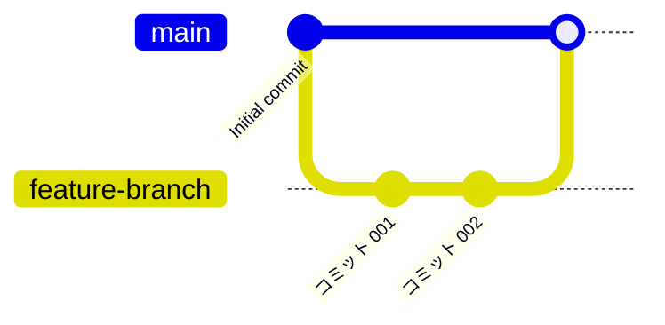
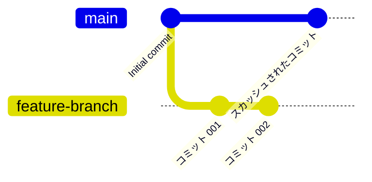
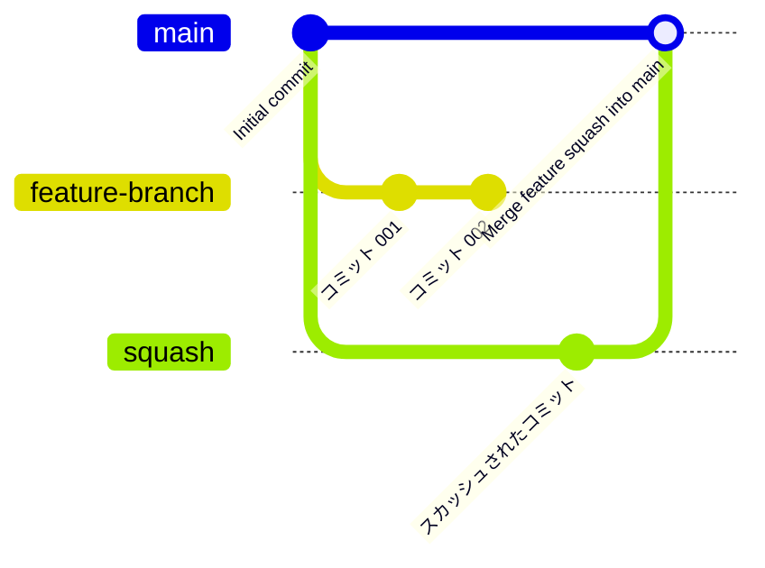

## はじめに

GitHubやGitLabを普段から利用している人にとって、スカッシュマージはコミット履歴を圧縮するための有用な機能です。
しかし、使用するプラットフォームによって、動作に違いがあります。

この記事では、GitHubとGitLabのスカッシュマージの違いとその特徴を解説します。

## 通常のマージ

## GitHubのスカッシュマージ

GitHubでは、プルリクエスト内の複数のコミットを1つにまとめて、マージコミットを作成せずにターゲットブランチへ統合する動作を検討します。

## GitLabのスカッシュマージ

GitLabのスカッシュマージは、複数のコミットを1つにまとめてマージコミットを作成します。
※ **オプションによってGitHubと同じ動作に設定できます**（`設定⇒マージリクエスト⇒マージ方法`で`早送りマージ(Fast-forward merge)`を設定する）。

## 主な違い

| 要素 | GitHub | GitLab |
|----|----|----|
| マージコミットの扱い | 作成しない | 作成する(オプションで変更可能) |
| 設定の柔軟性 | 決まった動作 | プロジェクト単位の設定が可能 |

## おわりに

GitHubとGitLabのスカッシュマージは両方とも優れた機能です。
移行した際などに動作が違うことをびっくりしないようにしましょう。

## 参考

- [GitHub Documentation - Squash and Merge](https://docs.github.com/)
- [GitLab Documentation - Squash and Merge](https://docs.gitlab.com/)
